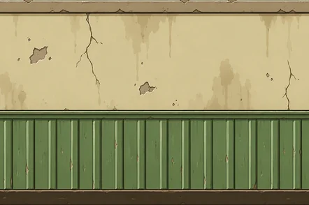
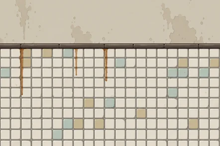
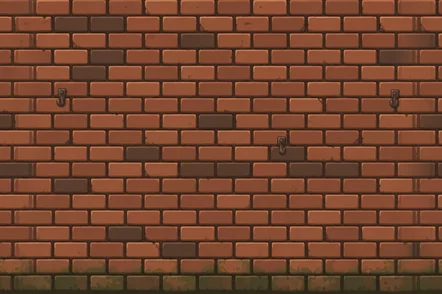
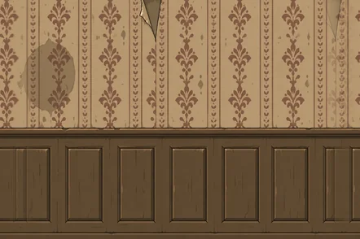
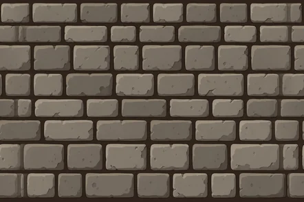

# Grafikkleveranse 28. september 2026

> Fra 28.9.2026 er `gpt-grafikk/` en innboks. Originalene fra denne leveransen ligger i git-historikken (commit 578f6f2, se `arkiv/grafikk-originaler.md`), og de behandlede bildene i `assets/ferdig/`.

53 nye manifestbilder er levert som 14 PNG-filer i `gpt-grafikk/`. Status er 611 av 636 bilder.

## Levert

| Bestilling | Filer | Bildedeler |
|---|---:|---:|
| Veggprøven: panel, fliser, mur, tapet og stein | 5 | 5 |
| Lærlingen, Klokkeren, Holdningssøsteren, Oldermannen, Kapellanen og Draugpleieren | 6 figurark | 36 |
| Avløpsarmens tupp | 1 | 1 |
| Kraken: kappe, øye, pupill, nebb, skum og bandasje | 1 ark | 6 |
| Våpen: reim, bjelle, tommestokk, klubbe og avgud | 1 ark | 5 |

Originalene ligger i `gpt-grafikk/` med filnavnene fra bestillingen. Alle er laget med innebygd bildegenerering. Prompter og retting av marger står i [prompter.json](prompter.json). Den ferdige tegneliste 13 er bevart som [bestilling-havet-og-skinnlauget.md](bestilling-havet-og-skinnlauget.md).

## Veggprøven til vurdering

| Panel | Fliser |
|---|---|
|  |  |

| Mur | Tapet |
|---|---|
|  |  |

Prøven er vist til Tom i samtalen. Claude må fortsatt vurdere den i spillet på PC og mobil før de ni øvrige veggene bestilles.

## Kontroll

- Alle 14 kildefiler åpner som PNG. Veggene er ugjennomsiktige og 1536 x 1024. Figurarkene er 1536 x 1024 med alfa. Avløpsarmen og de to gjenstandsarkene er kvadratiske med alfa.
- Seks hoder og kropper per figurark, riktige visninger og ingen tegnet del over klippekantene. Fire ark fikk større marger etter første kontroll.
- Repoets `skjaer_ark.py` gir 47 deler fra de åtte arkene. Med Avløpsarmen og veggene er leveransen 53 bilder. Alle 53 klipte kilder er åpnet og kontrollert som gyldige PNG-filer.
- Bildeløpet og `build.py` er kjørt i en separat kontrollmappe. Det ferdige bygget inneholder 611 bilder, 124 deler og 165 lyder. En tom mellomfil for Klokkerens kropp ble klippet på nytt. Fire originalark som ble liggende i kontrollmappen, ble meldt som ukjente av bildebehandlingen; alle manifestbildene ble behandlet.
- Ferdigbehandlede prøver av hoder, kropp, Kraken og vegger er sett over. Veggene skaleres til 442 x 294, og repoets eksisterende sømretting brukes.
- Spillkode og bildeskript er uendret. Kontroll av faktisk utseende på PC og mobil gjenstår hos Claude.

## Det som venter

- Ni vegger i [tegneliste 11](../../tegnelister/11_vegger.md): tre panelvarianter, polstret vegg, trevegg, paviljong, tømmer, gjerde og forheng. Venter på vurdering av veggprøven.
- 16 gulv i [tegneliste 12](../../tegnelister/12_gulv.md). Bestillingen sier at de først skal lages når Claude har lagt inn egne gulvfliser. Denne oppgaven står fortsatt åpen i `todo.md`.

Tegnelistene og ART_BRIEF er regenerert fra manifestet og de leverte filene. Oppføringene 11a til 11i i den nye listen er omnummerert av verktøyet; bruk filnavnene som fast identifikator.

