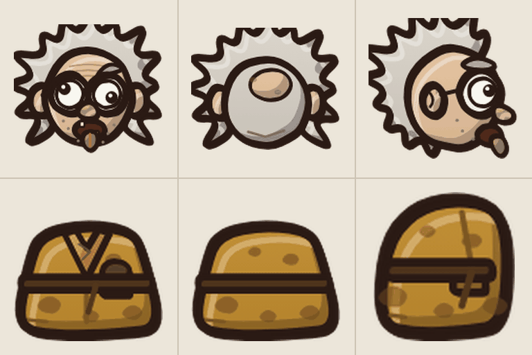
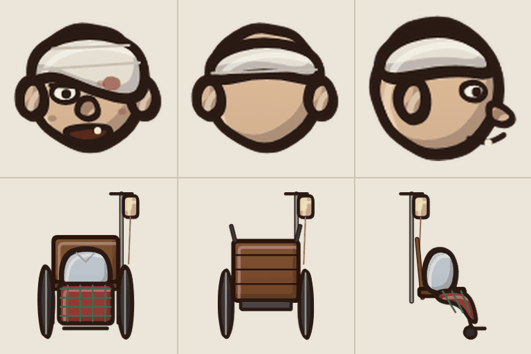
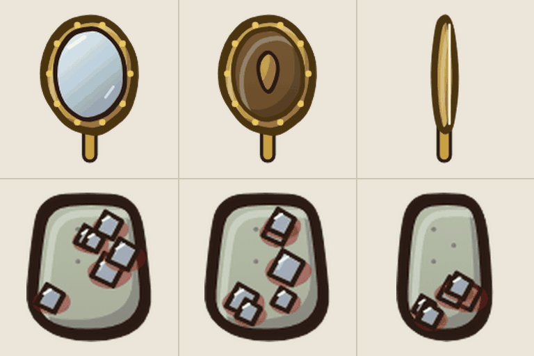
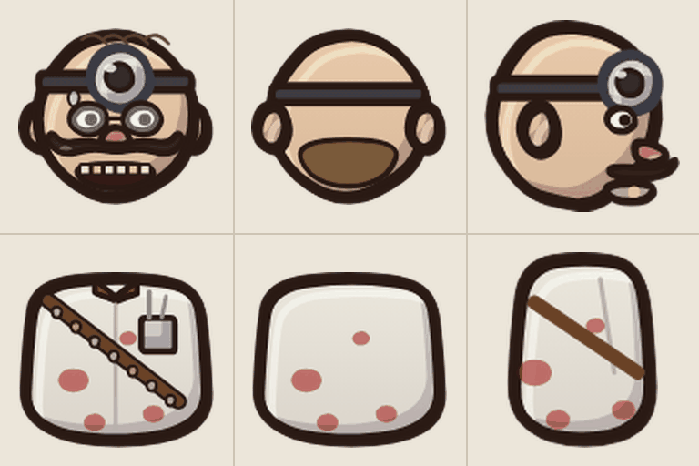
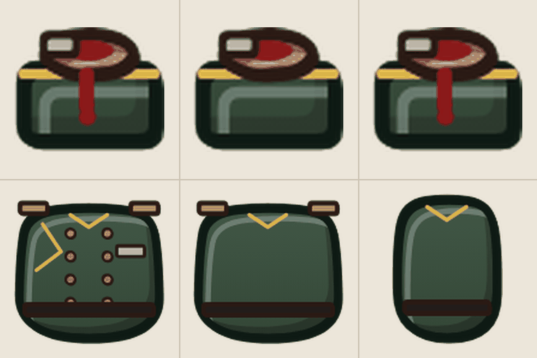
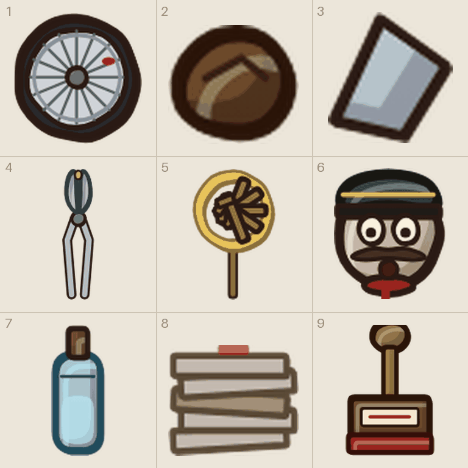

# Tegneliste 1: Fiendene og minisjefene i sanatoriet

Laget av `tools/lag_tegnelister.py`. Ikke rediger for hånd; kjør skriptet på nytt når bilder er levert, så forsvinner det som er ferdig.

De vanlige fiendene fra 1. etasje (Kasteren, Trillepasienten og Speilpasienten) og minisjefene Tannlegen og Portieren. Figurarkene først, så våpnene og småtingene deres på ett «ni ting»-ark.

## Slik gjør du det

1. Start en ny samtale i ChatGPT og lim inn stilblokken under. Bruk samme samtale for hele lista, så stilen holder seg.
2. For hvert ark: last opp malen fra `maler/` (står ved arket), og referansebildet hvis det står et. Lim inn prompten.
3. Last ned resultatet som PNG og gi det nøyaktig filnavnet som står ved arket.
4. Last fila opp til `gpt-grafikk/` i repoet (Add file, Upload files) og commit til `main`. Resten går av seg selv.

## Stilblokk (lim inn først)

```text
Style: hand-drawn cartoon game art in the style of Conan Chop Chop mixed with Castle Crashers. Thick dark brown ink outlines (#2a1a14) with a slightly wobbly, hand-inked line that is heavier on the lower right. Flat colors with one darker cel-shade tone on the lower right and a small light highlight on the upper left. Light always comes from the upper left. Muted, warm 1920s palette. Setting: a 1920s Norwegian sanatorium, Lovecraftian and a bit gross, but with dark humor. Big heads, small bodies, chunky shapes. Keep this exact style, line thickness and palette for every image in this conversation.
Technical: PNG with a TRANSPARENT background. No text unless asked, no ground shadows, no frames, no background scenery.
```

## 1a. Kasteren (figurark)

Filnavn: `figur_kasteren.png`

Mal: `maler/mal_figur.png`

Gir: `hode_kasteren_f/b/s` og `kropp_kasteren_f/b/s`

Referanse (last opp sammen med malen): `tegnelister/referanse/ref_figur_kasteren.png`



```text
Using the attached template (mal_figur.png), draw the character described below in a 3 x 2 grid.
Top row: the HEAD ONLY (no neck, no body): front view, back view, and side view facing right. Each head fills the dashed circle and rests on the + mark.
Bottom row: the TORSO AND HIPS ONLY (no head, no arms, no legs), fitted to the dashed shape. The shoulders must sit on the magenta dots, because the game attaches the arms there.
Keep every drawing inside its own cell. Do not draw the magenta guides.
Faces: rough, ugly and morbid, with crooked silhouettes, uneven eyes and teeth, heavy bags under the eyes, scraggly hair and rough ink lines with a little hatching. Grotesque and comic, but easy to recognize from every angle.
The second attached image shows the placeholder drawings the game uses today, in the same cells. Use it only to see what goes where and roughly how it is posed; redraw everything properly in our style.
Character: the Thrower: a skinny old man with wild grey hair sticking out in all directions, huge round glasses that magnify his mismatched eyes, open mouth with the tongue hanging out, a mustard-yellow bathrobe with brown stains and a lumpy pocket.
```

## 1b. Trillepasienten (figurark)

Filnavn: `figur_trille.png`

Mal: `maler/mal_figur.png`

Gir: `hode_trille_f/b/s` og `kropp_trille_f/b/s`

Referanse (last opp sammen med malen): `tegnelister/referanse/ref_figur_trille.png`



```text
Using the attached template (mal_figur.png), draw the character described below in a 3 x 2 grid.
Top row: the HEAD ONLY (no neck, no body): front view, back view, and side view facing right. Each head fills the dashed circle and rests on the + mark.
Bottom row: the TORSO AND HIPS ONLY (no head, no arms, no legs), fitted to the dashed shape. The shoulders must sit on the magenta dots, because the game attaches the arms there.
Keep every drawing inside its own cell. Do not draw the magenta guides.
Faces: rough, ugly and morbid, with crooked silhouettes, uneven eyes and teeth, heavy bags under the eyes, scraggly hair and rough ink lines with a little hatching. Grotesque and comic, but easy to recognize from every angle.
Important: draw the wheelchair WITHOUT its two big side wheels. The game adds the wheel, which is drawn separately, and spins it.
The second attached image shows the placeholder drawings the game uses today, in the same cells. Use it only to see what goes where and roughly how it is posed; redraw everything properly in our style.
Character: the Wheelchair Patient: a bald old man with a bandage wound around his head and over one eye and a toothless grin, slumped in a creaky wooden wheelchair with big spoked wheels, a red and green plaid blanket over his knees and an IV stand with a yellow bag behind him (the body part is the chair, blanket and torso together; the chair reaches the floor).
```

## 1c. Speilpasienten (figurark)

Filnavn: `figur_speil.png`

Mal: `maler/mal_figur.png`

Gir: `hode_speil_f/b/s` og `kropp_speil_f/b/s`

Referanse (last opp sammen med malen): `tegnelister/referanse/ref_figur_speil.png`



```text
Using the attached template (mal_figur.png), draw the character described below in a 3 x 2 grid.
Top row: the HEAD ONLY (no neck, no body): front view, back view, and side view facing right. Each head fills the dashed circle and rests on the + mark.
Bottom row: the TORSO AND HIPS ONLY (no head, no arms, no legs), fitted to the dashed shape. The shoulders must sit on the magenta dots, because the game attaches the arms there.
Keep every drawing inside its own cell. Do not draw the magenta guides.
The second attached image shows the placeholder drawings the game uses today, in the same cells. Use it only to see what goes where and roughly how it is posed; redraw everything properly in our style.
Character: the Mirror Patient: a thin patient whose head is an ornate gilded hand mirror on its handle (the glass is blank and cracked, the game shows a reflection in it), grey-green hospital gown with shards of mirror glued into it and a little blood around them.
```

## 1d. Tannlegen (minisjef) (figurark)

Filnavn: `figur_tannlege.png`

Mal: `maler/mal_figur.png`

Gir: `hode_tannlege_f/b/s` og `kropp_tannlege_f/b/s`

Referanse (last opp sammen med malen): `tegnelister/referanse/ref_figur_tannlege.png`



```text
Using the attached template (mal_figur.png), draw the character described below in a 3 x 2 grid.
Top row: the HEAD ONLY (no neck, no body): front view, back view, and side view facing right. Each head fills the dashed circle and rests on the + mark.
Bottom row: the TORSO AND HIPS ONLY (no head, no arms, no legs), fitted to the dashed shape. The shoulders must sit on the magenta dots, because the game attaches the arms there.
Keep every drawing inside its own cell. Do not draw the magenta guides.
Faces: rough, ugly and morbid, with crooked silhouettes, uneven eyes and teeth, heavy bags under the eyes, scraggly hair and rough ink lines with a little hatching. Grotesque and comic, but easy to recognize from every angle.
The second attached image shows the placeholder drawings the game uses today, in the same cells. Use it only to see what goes where and roughly how it is posed; redraw everything properly in our style.
Character: MINI-BOSS the Dentist: bald with a round head mirror on a headband, pince-nez, a big waxed mustache, a manic grin with several gold teeth, white coat with blood spots and a leather bandolier of pulled teeth.
```

## 1e. Den hodeløse portieren (minisjef) (figurark)

Filnavn: `figur_portier.png`

Mal: `maler/mal_figur.png`

Gir: `hode_portier_f/b/s` og `kropp_portier_f/b/s`

Referanse (last opp sammen med malen): `tegnelister/referanse/ref_figur_portier.png`



```text
Using the attached template (mal_figur.png), draw the character described below in a 3 x 2 grid.
Top row: the HEAD ONLY (no neck, no body): front view, back view, and side view facing right. Each head fills the dashed circle and rests on the + mark.
Bottom row: the TORSO AND HIPS ONLY (no head, no arms, no legs), fitted to the dashed shape. The shoulders must sit on the magenta dots, because the game attaches the arms there.
Keep every drawing inside its own cell. Do not draw the magenta guides.
The second attached image shows the placeholder drawings the game uses today, in the same cells. Use it only to see what goes where and roughly how it is posed; redraw everything properly in our style.
Character: MINI-BOSS the Headless Doorman: a tall doorman in a dark green uniform with two rows of gold buttons and gold epaulettes, but with NO HEAD, only a bloody neck stump above a high collar (the head part is just the stump and collar).
```

## 1f. Våpen og småting («ni ting»-ark)

Filnavn: `ark__hjul_trille_f__vaapen_klump__glasskar__vaapen_tang__vaapen_knippe__portierhode__vaapen_gasskolbe__vaapen_skjemabunke__vaapen_stempelboss.png`

Mal: `maler/mal_ni_ting.png`

Gir: 1 `hjul_trille_f`, 2 `vaapen_klump`, 3 `glasskar`, 4 `vaapen_tang`, 5 `vaapen_knippe`, 6 `portierhode`, 7 `vaapen_gasskolbe`, 8 `vaapen_skjemabunke`, 9 `vaapen_stempelboss`

Referanse (last opp sammen med malen): `tegnelister/referanse/ref_vaapen_og_smating.png`



```text
Using the attached template (mal_ni_ting.png), draw nine separate items, one per cell, read left to right, top to bottom.
Each item sits on the short line with its bottom touching the + mark. Icons, cards and loose body parts are centered in the cell instead. Things that lie flat on the ground are drawn seen from straight above. Keep every drawing inside its own cell. Do not draw the magenta guides.
Weapons stand upright with the handle at the bottom and the tip at the top; the game rotates them.
The second attached image shows the placeholder drawings the game uses today, in the same cells. Use it only to see what goes where and roughly how it is posed; redraw everything properly in our style.
Items:
1) ONE big wooden wheelchair wheel with spokes and a rubber tire, seen straight from the side (the game spins it).
2) a brown lump the Thrower holds in his hand (you know what it is), drawn alone.
3) a small shard of broken mirror glass.
4) a giant pair of dental pliers with a gold tooth in the jaws, handles down.
5) a huge iron key ring with five big old brass keys, handle down.
6) the doorman's severed head carried as an object: pale and surprised, big mustache, green doorman's cap with a gold band, a little blood at the neck.
7) a glass ether bottle with a cork, held as a weapon.
8) a messy stack of official paper forms held as a weapon.
9) a giant wooden office stamp with a red rubber foot, handle down.
```
