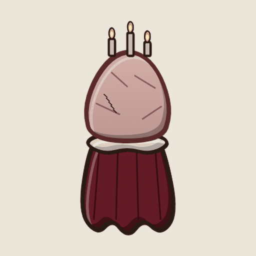
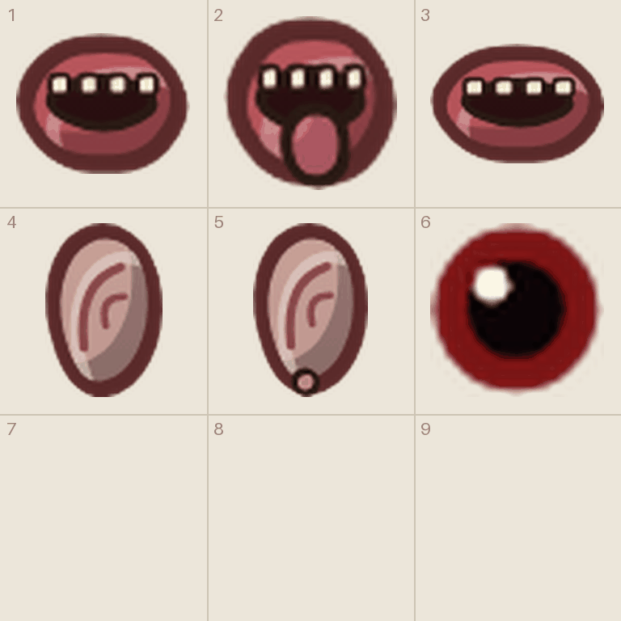
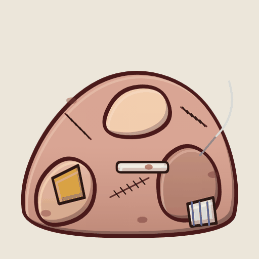
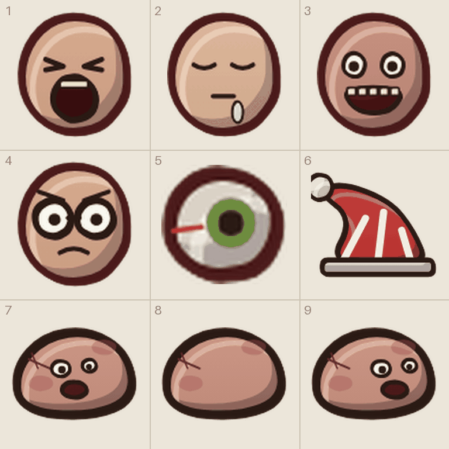

# Tegneliste 2: Hviskekoret og Den Store Klumpen

Laget av `tools/lag_tegnelister.py`. Ikke rediger for hånd; kjør skriptet på nytt når bilder er levert, så forsvinner det som er ferdig.

Lagdelte skapninger (del H i `DESIGN_BRIEF.md`): kroppen tegnes alene som et eget bilde, og de løse delene samles på «ni ting»-ark. Spillet flytter munnene, ørene og ansiktene hver for seg. Pupillen er den som ruller rundt i øyet i veggsprekken.

## Slik gjør du det

1. Start en ny samtale i ChatGPT og lim inn stilblokken under. Bruk samme samtale for hele lista, så stilen holder seg.
2. For hvert ark: last opp malen fra `maler/` (står ved arket), og referansebildet hvis det står et. Lim inn prompten.
3. Last ned resultatet som PNG og gi det nøyaktig filnavnet som står ved arket.
4. Last fila opp til `gpt-grafikk/` i repoet (Add file, Upload files) og commit til `main`. Resten går av seg selv.

## Stilblokk (lim inn først)

```text
Style: hand-drawn cartoon game art in the style of Conan Chop Chop mixed with Castle Crashers. Thick dark brown ink outlines (#2a1a14) with a slightly wobbly, hand-inked line that is heavier on the lower right. Flat colors with one darker cel-shade tone on the lower right and a small light highlight on the upper left. Light always comes from the upper left. Muted, warm 1920s palette. Setting: a 1920s Norwegian sanatorium, Lovecraftian and a bit gross, but with dark humor. Big heads, small bodies, chunky shapes. Keep this exact style, line thickness and palette for every image in this conversation.
Technical: PNG with a TRANSPARENT background. No text unless asked, no ground shadows, no frames, no background scenery.
```

## 2a. Hviskekorets kropp (enkeltbilde)

Filnavn: `koret_kropp.png`

Gir: `koret_kropp`

Referanse (last opp sammen med prompten): `tegnelister/referanse/ref_koret_kropp.png`



```text
Draw ONE image, 1024 x 1536 (portrait): MINI-BOSS the Whispering Choir, BODY ONLY: a floating torn burgundy choir robe with a white ruffled collar, a tall column of pale pink flesh bursting out of the collar with stitches, and three lit candles on top. No mouths and no ears (the game adds them).
Exactly one object, centered and fully visible, not cropped. Transparent background, no ground shadow, no text, no frame.
The attached image shows the placeholder the game uses today. Use it only to see what it is; redraw it properly in our style.
```

## 2b. Korets munner og ører («ni ting»-ark)

Filnavn: `ark__koret_munn0__koret_munn1__koret_munn2__koret_ore0__koret_ore1__pupill.png`

Mal: `maler/mal_ni_ting.png`

Gir: 1 `koret_munn0`, 2 `koret_munn1`, 3 `koret_munn2`, 4 `koret_ore0`, 5 `koret_ore1`, 6 `pupill`

Referanse (last opp sammen med malen): `tegnelister/referanse/ref_koret_deler.png`



```text
Using the attached template (mal_ni_ting.png), draw six separate items, one per cell, read left to right, top to bottom. Use only the first six cells and leave the rest empty.
Each item sits on the short line with its bottom touching the + mark. Icons, cards and loose body parts are centered in the cell instead. Things that lie flat on the ground are drawn seen from straight above. Keep every drawing inside its own cell. Do not draw the magenta guides.
Each part is drawn alone and centered in its cell, nothing around it.
The second attached image shows the placeholder drawings the game uses today, in the same cells. Use it only to see what goes where and roughly how it is posed; redraw everything properly in our style.
Items:
1) ONE human mouth with red lips and teeth, half open, drawn alone.
2) ONE human mouth with red lips, teeth and the tongue sticking out, drawn alone.
3) ONE wide human mouth with red lips and teeth, whispering, drawn alone.
4) ONE human ear, fleshy pink, drawn alone.
5) ONE human ear with a small gold earring, drawn alone.
6) a small red iris with a black pupil and a white highlight.
```

## 2c. Klumpens kropp (enkeltbilde)

Filnavn: `klumpen_kropp.png`

Gir: `klumpen_kropp`

Referanse (last opp sammen med prompten): `tegnelister/referanse/ref_klumpen_kropp.png`



```text
Draw ONE image, 1024 x 1024 (square): BOSS the Big Lump, BODY ONLY: a huge mound of fused human flesh in different skin tones, with stitches, bandages, a stuck IV needle with a tube, a piece of a yellow bathrobe and a striped pyjama patch grown into it. No faces and no arms (the game adds them).
Exactly one object, centered and fully visible, not cropped. Transparent background, no ground shadow, no text, no frame.
The attached image shows the placeholder the game uses today. Use it only to see what it is; redraw it properly in our style.
```

## 2d. Klumpens ansikter, øye, lue og ungene («ni ting»-ark)

Filnavn: `ark__klumpen_ansikt0__klumpen_ansikt1__klumpen_ansikt2__klumpen_ansikt3__klumpen_oye__klumpen_lue__blob_klumpunge_f__blob_klumpunge_b__blob_klumpunge_s.png`

Mal: `maler/mal_ni_ting.png`

Gir: 1 `klumpen_ansikt0`, 2 `klumpen_ansikt1`, 3 `klumpen_ansikt2`, 4 `klumpen_ansikt3`, 5 `klumpen_oye`, 6 `klumpen_lue`, 7 `blob_klumpunge_f`, 8 `blob_klumpunge_b`, 9 `blob_klumpunge_s`

Referanse (last opp sammen med malen): `tegnelister/referanse/ref_klumpen_deler.png`



```text
Using the attached template (mal_ni_ting.png), draw nine separate items, one per cell, read left to right, top to bottom.
Each item sits on the short line with its bottom touching the + mark. Icons, cards and loose body parts are centered in the cell instead. Things that lie flat on the ground are drawn seen from straight above. Keep every drawing inside its own cell. Do not draw the magenta guides.
Cells 7 to 9 are the same small creature: a lump spawn of pink fused flesh with a tiny face, in front view, back view and side view facing right.
The second attached image shows the placeholder drawings the game uses today, in the same cells. Use it only to see what goes where and roughly how it is posed; redraw everything properly in our style.
Items:
1) ONE human face sunk into pink flesh, screaming with the eyes squeezed shut, drawn alone.
2) ONE human face sunk into pink flesh, sleeping and drooling, drawn alone.
3) ONE human face sunk into pink flesh, smiling far too wide with many teeth, drawn alone.
4) ONE human face sunk into pink flesh, wearing round glasses and looking worried, drawn alone.
5) ONE loose bloodshot eyeball with a green iris.
6) a red and white striped nightcap with a white pompom, drawn alone.
7) klumpunge. front view, facing the viewer.
8) klumpunge. back view, facing away.
9) klumpunge. side view, facing right.
```
