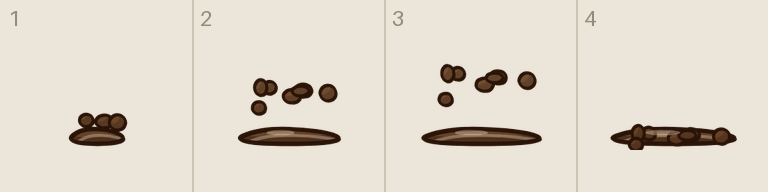
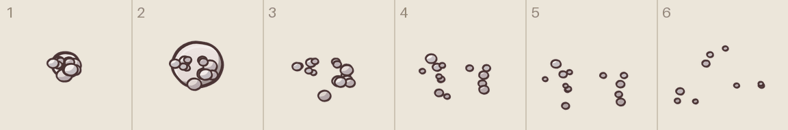
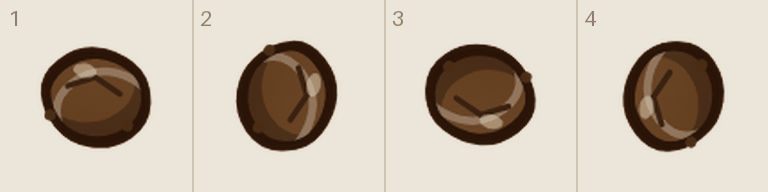
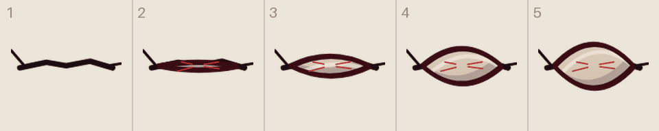
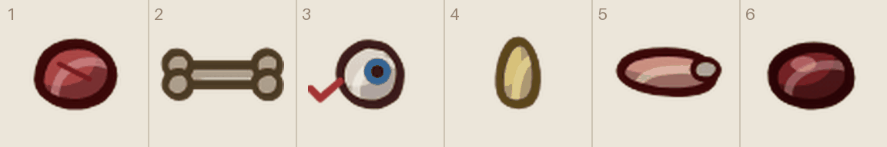

# Tegneliste 3: Spriteark

Laget av `tools/lag_tegnelister.py`. Ikke rediger for hånd; kjør skriptet på nytt når bilder er levert, så forsvinner det som er ferdig.

Små animasjoner, bilde for bilde (del I i `DESIGN_BRIEF.md`). Like store ruter på én rad, og samme festepunkt i hver rute, ellers hopper tingen. Ingen mal; formatet spiller ingen rolle så lenge rutene er like store. Kastespruten og blodspruten synes mest.

## Slik gjør du det

1. Start en ny samtale i ChatGPT og lim inn stilblokken under. Bruk samme samtale for hele lista, så stilen holder seg.
2. For hvert ark: last opp malen fra `maler/` (står ved arket), og referansebildet hvis det står et. Lim inn prompten.
3. Last ned resultatet som PNG og gi det nøyaktig filnavnet som står ved arket.
4. Last fila opp til `gpt-grafikk/` i repoet (Add file, Upload files) og commit til `main`. Resten går av seg selv.

## Stilblokk (lim inn først)

```text
Style: hand-drawn cartoon game art in the style of Conan Chop Chop mixed with Castle Crashers. Thick dark brown ink outlines (#2a1a14) with a slightly wobbly, hand-inked line that is heavier on the lower right. Flat colors with one darker cel-shade tone on the lower right and a small light highlight on the upper left. Light always comes from the upper left. Muted, warm 1920s palette. Setting: a 1920s Norwegian sanatorium, Lovecraftian and a bit gross, but with dark humor. Big heads, small bodies, chunky shapes. Keep this exact style, line thickness and palette for every image in this conversation.
Technical: PNG with a TRANSPARENT background. No text unless asked, no ground shadows, no frames, no background scenery.
```

## 3a. Spruten når klumpen treffer (spriteark)

Filnavn: `anim_kastesprut.png`

Gir: `anim_kastesprut`

Referanse (last opp sammen med prompten): `tegnelister/referanse/ref_anim_kastesprut.png`



```text
SPRITE SHEET for a game animation, same ink-and-cel style: 4 equal cells in ONE horizontal row, read left to right: a brown splash hitting the floor, from a small impact to a big splat with droplets flying up, then settling. Same ground line in every cell. The same object in every cell, same size and same center (or the same ground line), only the motion changes. Nothing crosses into the next cell. No text, no grid lines, transparent background.
The attached image shows the placeholder frames the game draws today, in the same order and at the same scale.
```

## 3b. Blodspruten (spriteark)

Filnavn: `anim_blodsprut.png`

Gir: `anim_blodsprut`

Referanse (last opp sammen med prompten): `tegnelister/referanse/ref_anim_blodsprut.png`



```text
SPRITE SHEET for a game animation, same ink-and-cel style: 6 equal cells in ONE horizontal row, read left to right: a burst of droplets exploding outward and falling. Draw it in WHITE and light grey with dark outlines (the game colors it red, purple or yellow). Same ground line in every cell. The same object in every cell, same size and same center (or the same ground line), only the motion changes. Nothing crosses into the next cell. No text, no grid lines, transparent background.
The attached image shows the placeholder frames the game draws today, in the same order and at the same scale.
```

## 3c. Klumpen som snurrer i lufta (spriteark)

Filnavn: `anim_kasteklump.png`

Gir: `anim_kasteklump`

Referanse (last opp sammen med prompten): `tegnelister/referanse/ref_anim_kasteklump.png`



```text
SPRITE SHEET for a game animation, same ink-and-cel style: 4 equal cells in ONE horizontal row, read left to right: a brown lump spinning in the air, a quarter turn more in each frame. Same size and same center in every square. The same object in every cell, same size and same center (or the same ground line), only the motion changes. Nothing crosses into the next cell. No text, no grid lines, transparent background.
The attached image shows the placeholder frames the game draws today, in the same order and at the same scale.
```

## 3d. Øyet som åpner seg i veggsprekken (spriteark)

Filnavn: `anim_oye.png`

Gir: `anim_oye`

Referanse (last opp sammen med prompten): `tegnelister/referanse/ref_anim_oye.png`



```text
SPRITE SHEET for a game animation, same ink-and-cel style: 5 equal cells in ONE horizontal row, read left to right: an eye opening in a crack in a wall, from a closed slit to wide open, bloodshot white, NO pupil (the game adds the pupil). Same center in every cell. The same object in every cell, same size and same center (or the same ground line), only the motion changes. Nothing crosses into the next cell. No text, no grid lines, transparent background.
The attached image shows the placeholder frames the game draws today, in the same order and at the same scale.
```

## 3e. Kjøttbitene (spriteark)

Filnavn: `anim_kjottbiter.png`

Gir: `anim_kjottbiter`

Referanse (last opp sammen med prompten): `tegnelister/referanse/ref_anim_kjottbiter.png`



```text
SHEET, 6 equal squares in ONE row, six different small gore bits, one per square: a chunk of meat, a bone, an eyeball with a nerve, a gold tooth, a finger, a piece of liver. Same ink-and-cel style, 6 equal cells in ONE horizontal row. Nothing crosses into the next cell. No text, no grid lines, transparent background.
The attached image shows the placeholder frames the game draws today, in the same order and at the same scale.
```
