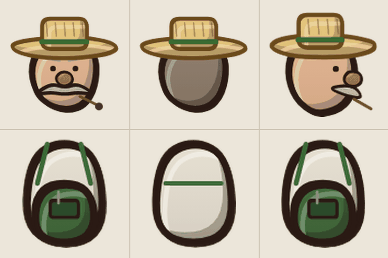
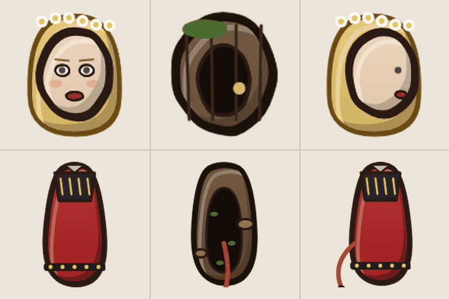
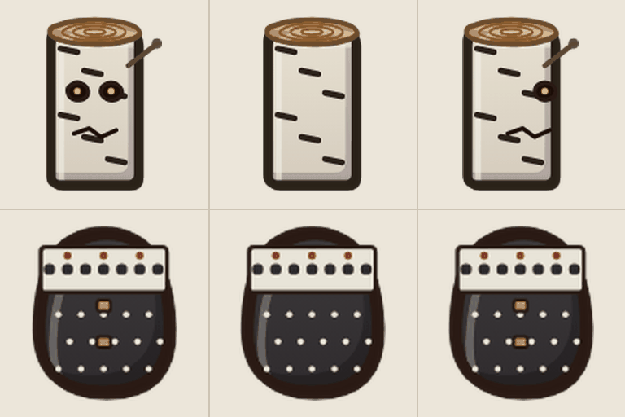
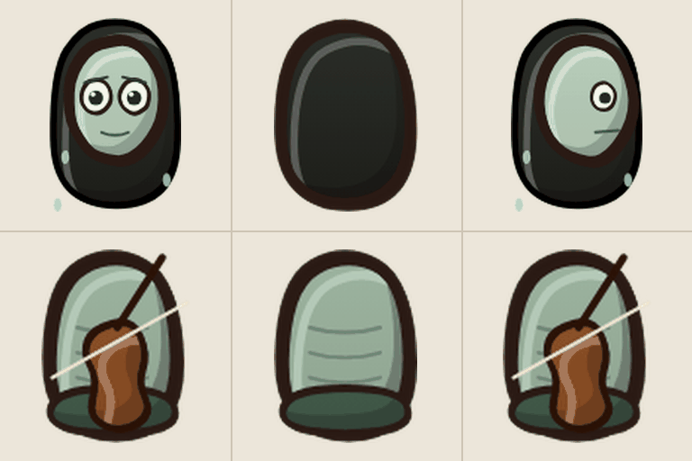
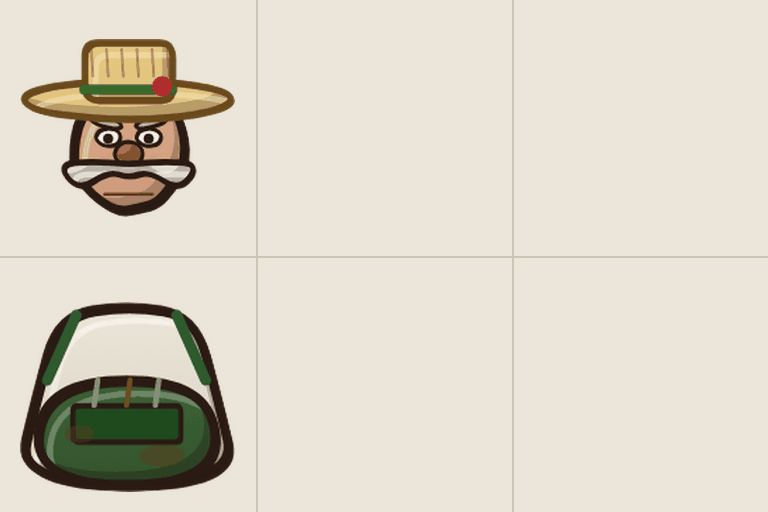
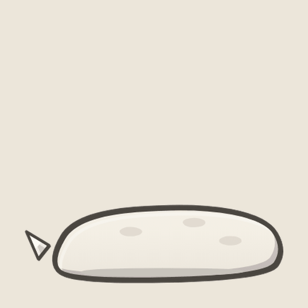
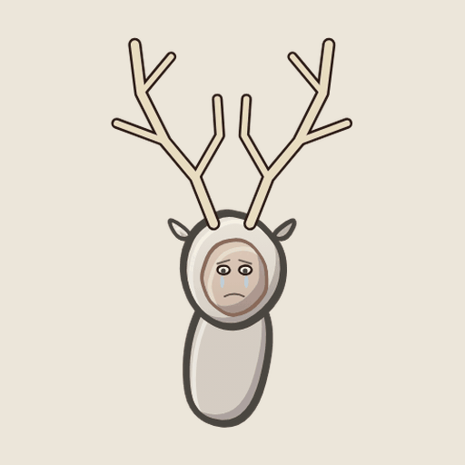
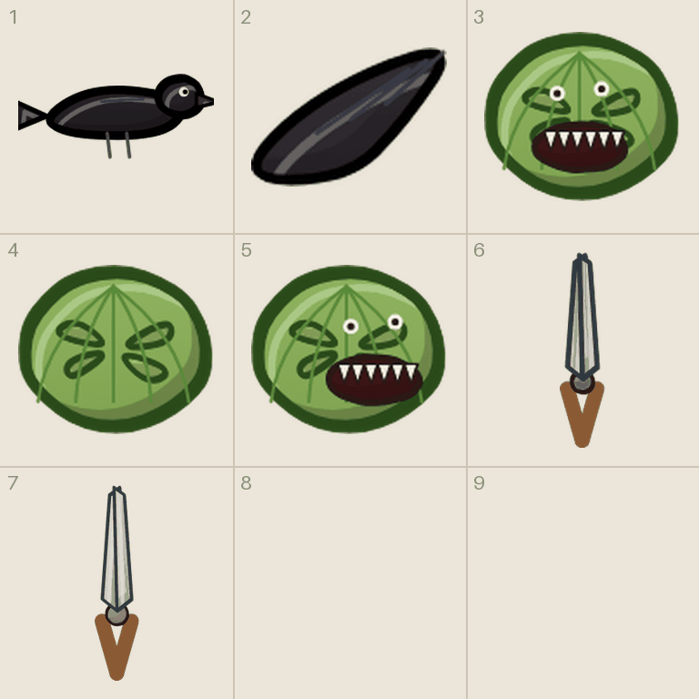

# Tegneliste 5: Parken og Nattskogen: fiender og sjefer

Laget av `tools/lag_tegnelister.py`. Ikke rediger for hånd; kjør skriptet på nytt når bilder er levert, så forsvinner det som er ferdig.

Gartnerne og kråkene i Parken, Huldra, Vedkubbemannen og Nøkken i Nattskogen, Overgartneren og Den hvite hjorten. Huldra er viktigst: bakfra er hun en råtten stamme, så baksiden på arket betyr mye. Hjorten er satt sammen av deler; kropp og hode tegnes hver for seg.

## Slik gjør du det

1. Start en ny samtale i ChatGPT og lim inn stilblokken under. Bruk samme samtale for hele lista, så stilen holder seg.
2. For hvert ark: last opp malen fra `maler/` (står ved arket), og referansebildet hvis det står et. Lim inn prompten.
3. Last ned resultatet som PNG og gi det nøyaktig filnavnet som står ved arket.
4. Last fila opp til `gpt-grafikk/` i repoet (Add file, Upload files) og commit til `main`. Resten går av seg selv.

## Stilblokk (lim inn først)

```text
Style: hand-drawn cartoon game art in the style of Conan Chop Chop mixed with Castle Crashers. Thick dark brown ink outlines (#2a1a14) with a slightly wobbly, hand-inked line that is heavier on the lower right. Flat colors with one darker cel-shade tone on the lower right and a small light highlight on the upper left. Light always comes from the upper left. Muted, warm 1920s palette. Setting: a 1920s Norwegian sanatorium, Lovecraftian and a bit gross, but with dark humor. Big heads, small bodies, chunky shapes. Keep this exact style, line thickness and palette for every image in this conversation.
Technical: PNG with a TRANSPARENT background. No text unless asked, no ground shadows, no frames, no background scenery.
```

## 5a. Gartneren (figurark)

Filnavn: `figur_gartner.png`

Mal: `maler/mal_figur.png`

Gir: `hode_gartner_f/b/s` og `kropp_gartner_f/b/s`

Referanse (last opp sammen med malen): `tegnelister/referanse/ref_figur_gartner.png`



```text
Using the attached template (mal_figur.png), draw the character described below in a 3 x 2 grid.
Top row: the HEAD ONLY (no neck, no body): front view, back view, and side view facing right. Each head fills the dashed circle and rests on the + mark.
Bottom row: the TORSO AND HIPS ONLY (no head, no arms, no legs), fitted to the dashed shape. The shoulders must sit on the magenta dots, because the game attaches the arms there.
Keep every drawing inside its own cell. Do not draw the magenta guides.
Faces: rough, ugly and morbid, with crooked silhouettes, uneven eyes and teeth, heavy bags under the eyes, scraggly hair and rough ink lines with a little hatching. Grotesque and comic, but easy to recognize from every angle.
The second attached image shows the placeholder drawings the game uses today, in the same cells. Use it only to see what goes where and roughly how it is posed; redraw everything properly in our style.
Character: a park gardener with a wide straw hat, a big white mustache, a red nose and a pipe, white shirt and a dark green apron with suspenders.
```

## 5b. Huldra (figurark)

Filnavn: `figur_huldra.png`

Mal: `maler/mal_figur.png`

Gir: `hode_huldra_f/b/s` og `kropp_huldra_f/b/s`

Referanse (last opp sammen med malen): `tegnelister/referanse/ref_figur_huldra.png`



```text
Using the attached template (mal_figur.png), draw the character described below in a 3 x 2 grid.
Top row: the HEAD ONLY (no neck, no body): front view, back view, and side view facing right. Each head fills the dashed circle and rests on the + mark.
Bottom row: the TORSO AND HIPS ONLY (no head, no arms, no legs), fitted to the dashed shape. The shoulders must sit on the magenta dots, because the game attaches the arms there.
Keep every drawing inside its own cell. Do not draw the magenta guides.
Front and side view: the beautiful woman. Back view: the hollow rotten trunk with moss, fungus and beetles, and the cow tail hanging down.
The second attached image shows the placeholder drawings the game uses today, in the same cells. Use it only to see what goes where and roughly how it is posed; redraw everything properly in our style.
Character: the Huldra from Norwegian folklore: a beautiful young woman with long golden hair and a crown of white wood anemones, red bunad with black and gold embroidery. SEEN FROM BEHIND (back view) she is a hollow rotten tree trunk with moss, fungus and beetles, and she has a cow tail.
```

## 5c. Vedkubbemannen (figurark)

Filnavn: `figur_vedkubbe.png`

Mal: `maler/mal_figur.png`

Gir: `hode_vedkubbe_f/b/s` og `kropp_vedkubbe_f/b/s`

Referanse (last opp sammen med malen): `tegnelister/referanse/ref_figur_vedkubbe.png`



```text
Using the attached template (mal_figur.png), draw the character described below in a 3 x 2 grid.
Top row: the HEAD ONLY (no neck, no body): front view, back view, and side view facing right. Each head fills the dashed circle and rests on the + mark.
Bottom row: the TORSO AND HIPS ONLY (no head, no arms, no legs), fitted to the dashed shape. The shoulders must sit on the magenta dots, because the game attaches the arms there.
Keep every drawing inside its own cell. Do not draw the magenta guides.
The second attached image shows the placeholder drawings the game uses today, in the same cells. Use it only to see what goes where and roughly how it is posed; redraw everything properly in our style.
Character: the Log Man: a man whose head is a birch log standing on end, with two glowing knot-hole eyes and a crack for a mouth, wearing a black and white Norwegian lusekofte sweater with pewter clasps.
```

## 5d. Nøkken (figurark)

Filnavn: `figur_nokken.png`

Mal: `maler/mal_figur.png`

Gir: `hode_nokken_f/b/s` og `kropp_nokken_f/b/s`

Referanse (last opp sammen med malen): `tegnelister/referanse/ref_figur_nokken.png`



```text
Using the attached template (mal_figur.png), draw the character described below in a 3 x 2 grid.
Top row: the HEAD ONLY (no neck, no body): front view, back view, and side view facing right. Each head fills the dashed circle and rests on the + mark.
Bottom row: the TORSO AND HIPS ONLY (no head, no arms, no legs), fitted to the dashed shape. The shoulders must sit on the magenta dots, because the game attaches the arms there.
Keep every drawing inside its own cell. Do not draw the magenta guides.
Faces: rough, ugly and morbid, with crooked silhouettes, uneven eyes and teeth, heavy bags under the eyes, scraggly hair and rough ink lines with a little hatching. Grotesque and comic, but easy to recognize from every angle.
The second attached image shows the placeholder drawings the game uses today, in the same cells. Use it only to see what goes where and roughly how it is posed; redraw everything properly in our style.
Character: the Nokken (Norwegian water spirit): a pale green man with long wet black hair, big sad eyes, bare ribs, holding a Hardanger fiddle across his chest, dripping water.
```

## 5e. Overgartner Ansgar Hekk (sjef) (figurark)

Filnavn: `figur_hekk.png`

Mal: `maler/mal_figur.png`

Gir: `hode_hekk_f` og `kropp_hekk_f`

Referanse (last opp sammen med malen): `tegnelister/referanse/ref_figur_hekk.png`



```text
Using the attached template (mal_figur.png), draw the character described below in a 3 x 2 grid.
Top row: the HEAD ONLY (no neck, no body): front view, back view, and side view facing right. Each head fills the dashed circle and rests on the + mark.
Bottom row: the TORSO AND HIPS ONLY (no head, no arms, no legs), fitted to the dashed shape. The shoulders must sit on the magenta dots, because the game attaches the arms there.
Keep every drawing inside its own cell. Do not draw the magenta guides.
Faces: rough, ugly and morbid, with crooked silhouettes, uneven eyes and teeth, heavy bags under the eyes, scraggly hair and rough ink lines with a little hatching. Grotesque and comic, but easy to recognize from every angle.
The front view matters most, the game uses it for the boss. Back and side views are a bonus.
The second attached image shows the placeholder drawings the game uses today, in the same cells. Use it only to see what goes where and roughly how it is posed; redraw everything properly in our style.
Character: BOSS: Head Gardener Ansgar Hekk, huge and red-faced, a wide straw hat with a rose in the band, an enormous white walrus mustache, white shirt, a dark green apron with garden tools in the pocket and manure stains.
```

## 5f. Hjortens kropp (enkeltbilde)

Filnavn: `hjort_kropp.png`

Gir: `hjort_kropp`

Referanse (last opp sammen med prompten): `tegnelister/referanse/ref_hjort_kropp.png`



```text
Draw ONE image, 1536 x 1024 (landscape): BOSS: the body of an enormous white stag seen from the side facing right, no head and no legs (the game draws the legs).
Exactly one object, centered and fully visible, not cropped. Transparent background, no ground shadow, no text, no frame.
The attached image shows the placeholder the game uses today. Use it only to see what it is; redraw it properly in our style.
```

## 5g. Hjortens hode og hals (enkeltbilde)

Filnavn: `hjort_hode.png`

Gir: `hjort_hode`

Referanse (last opp sammen med prompten): `tegnelister/referanse/ref_hjort_hode.png`



```text
Draw ONE image, 1024 x 1536 (portrait): BOSS: the neck and head of the white stag with huge antlers, but the face is a sad human face with tears.
Exactly one object, centered and fully visible, not cropped. Transparent background, no ground shadow, no text, no frame.
The attached image shows the placeholder the game uses today. Use it only to see what it is; redraw it properly in our style.
```

## 5h. Kråka, kålhodet og hagesaksene («ni ting»-ark)

Filnavn: `ark__kraake_kropp__kraake_vinge__blob_kaalhode_f__blob_kaalhode_b__blob_kaalhode_s__vaapen_hagesaks__vaapen_storsaks.png`

Mal: `maler/mal_ni_ting.png`

Gir: 1 `kraake_kropp`, 2 `kraake_vinge`, 3 `blob_kaalhode_f`, 4 `blob_kaalhode_b`, 5 `blob_kaalhode_s`, 6 `vaapen_hagesaks`, 7 `vaapen_storsaks`

Referanse (last opp sammen med malen): `tegnelister/referanse/ref_kraake_og_kaal.png`



```text
Using the attached template (mal_ni_ting.png), draw seven separate items, one per cell, read left to right, top to bottom. Use only the first seven cells and leave the rest empty.
Each item sits on the short line with its bottom touching the + mark. Icons, cards and loose body parts are centered in the cell instead. Things that lie flat on the ground are drawn seen from straight above. Keep every drawing inside its own cell. Do not draw the magenta guides.
The shears stand upright with the handles at the bottom.
The second attached image shows the placeholder drawings the game uses today, in the same cells. Use it only to see what goes where and roughly how it is posed; redraw everything properly in our style.
Items:
1) a black crow seen from the side facing right, one pale eye, the body only (the wing is a separate image).
2) one black crow wing, spread.
3) a small cabbage head with a mouth full of sharp teeth and two little eyes. front view, facing the viewer.
4) a small cabbage head with a mouth full of sharp teeth and two little eyes. back view, facing away.
5) a small cabbage head with a mouth full of sharp teeth and two little eyes. side view, facing right.
6) garden hedge shears with wooden handles.
7) enormous garden hedge shears with long wooden handles.
```
