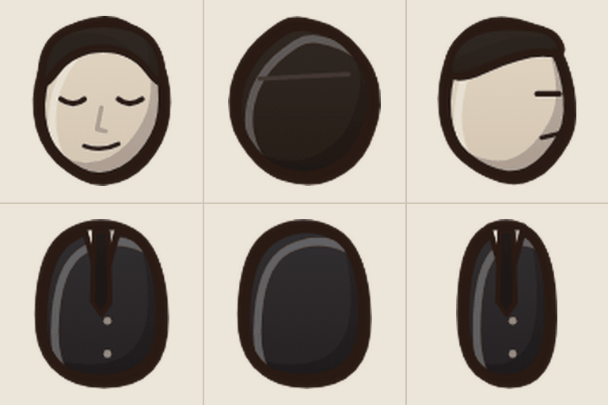
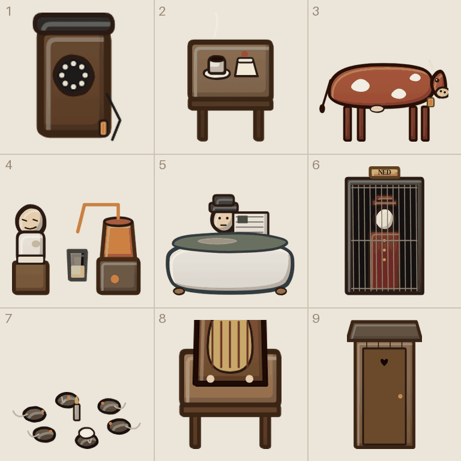
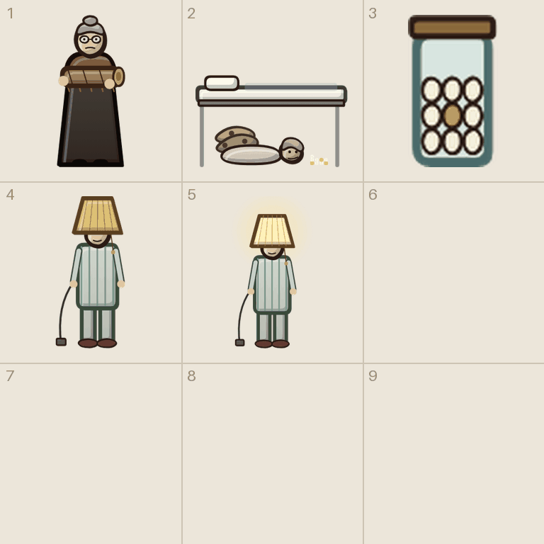
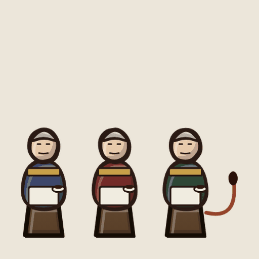
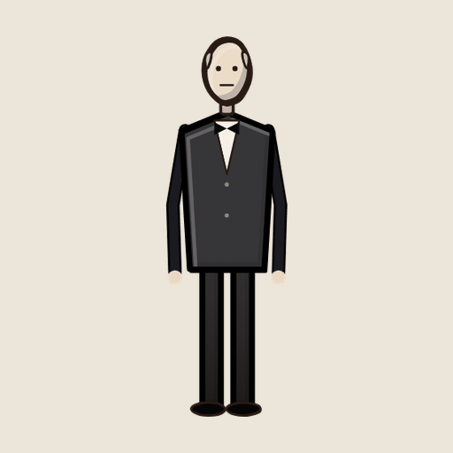

# Tegneliste 6: Hendelsene

Laget av `tools/lag_tegnelister.py`. Ikke rediger for hånd; kjør skriptet på nytt når bilder er levert, så forsvinner det som er ferdig.

De absurde hendelsene. Tonen er David Lynch på et norsk sanatorium i 1923: hverdagslig, litt feil, aldri skummelt på den åpenbare måten. Bildene vises også stort i samtalepanelet, så de fortjener litt ekstra.

## Slik gjør du det

1. Start en ny samtale i ChatGPT og lim inn stilblokken under. Bruk samme samtale for hele lista, så stilen holder seg.
2. For hvert ark: last opp malen fra `maler/` (står ved arket), og referansebildet hvis det står et. Lim inn prompten.
3. Last ned resultatet som PNG og gi det nøyaktig filnavnet som står ved arket.
4. Last fila opp til `gpt-grafikk/` i repoet (Add file, Upload files) og commit til `main`. Resten går av seg selv.

## Stilblokk (lim inn først)

```text
Style: hand-drawn cartoon game art in the style of Conan Chop Chop mixed with Castle Crashers. Thick dark brown ink outlines (#2a1a14) with a slightly wobbly, hand-inked line that is heavier on the lower right. Flat colors with one darker cel-shade tone on the lower right and a small light highlight on the upper left. Light always comes from the upper left. Muted, warm 1920s palette. Setting: a 1920s Norwegian sanatorium, Lovecraftian and a bit gross, but with dark humor. Big heads, small bodies, chunky shapes. Keep this exact style, line thickness and palette for every image in this conversation.
Technical: PNG with a TRANSPARENT background. No text unless asked, no ground shadows, no frames, no background scenery.
```

## 6a. Mannen som går baklengs (figurark)

Filnavn: `figur_baklengs.png`

Mal: `maler/mal_figur.png`

Gir: `hode_baklengs_f/b/s` og `kropp_baklengs_f/b/s`

Referanse (last opp sammen med malen): `tegnelister/referanse/ref_figur_baklengs.png`



```text
Using the attached template (mal_figur.png), draw the character described below in a 3 x 2 grid.
Top row: the HEAD ONLY (no neck, no body): front view, back view, and side view facing right. Each head fills the dashed circle and rests on the + mark.
Bottom row: the TORSO AND HIPS ONLY (no head, no arms, no legs), fitted to the dashed shape. The shoulders must sit on the magenta dots, because the game attaches the arms there.
Keep every drawing inside its own cell. Do not draw the magenta guides.
The second attached image shows the placeholder drawings the game uses today, in the same cells. Use it only to see what goes where and roughly how it is posed; redraw everything properly in our style.
Character: a pale man in a neat black suit and tie with his eyes closed and a small calm smile (he walks backwards and talks backwards).
```

## 6b. Telefonen, kua, heisen og de andre («ni ting»-ark)

Filnavn: `ark__prop_telefon__prop_kaffebord__prop_ku__prop_brennevin__prop_badekarmann__prop_heis__prop_rotter__prop_radiobord__prop_utedo.png`

Mal: `maler/mal_ni_ting.png`

Gir: 1 `prop_telefon`, 2 `prop_kaffebord`, 3 `prop_ku`, 4 `prop_brennevin`, 5 `prop_badekarmann`, 6 `prop_heis`, 7 `prop_rotter`, 8 `prop_radiobord`, 9 `prop_utedo`

Referanse (last opp sammen med malen): `tegnelister/referanse/ref_hendelser_1.png`



```text
Using the attached template (mal_ni_ting.png), draw nine separate items, one per cell, read left to right, top to bottom.
Each item sits on the short line with its bottom touching the + mark. Icons, cards and loose body parts are centered in the cell instead. Things that lie flat on the ground are drawn seen from straight above. Keep every drawing inside its own cell. Do not draw the magenta guides.
Everyday things that are slightly wrong. Seen from the front and slightly above, like the furniture.
The second attached image shows the placeholder drawings the game uses today, in the same cells. Use it only to see what goes where and roughly how it is posed; redraw everything properly in our style.
Items:
1) a wooden wall telephone with a rotary dial and the receiver hanging on its cord.
2) a small cafe table with a cup of black coffee and a slice of cream cake with one cherry.
3) a brown and white cow standing sideways, calm wet eyes and a brass bell.
4) a patient in long underwear next to a copper moonshine still on a crate.
5) a man in a dark suit and hat sitting fully dressed in a clawfoot bathtub of grey water, reading a newspaper.
6) an old cage elevator; inside stands a lift operator in a red uniform and cap with no face.
7) six rats sitting in a ring around a candle stump, the biggest wearing a white judge wig.
8) a 1920s wooden radio set on a small table.
9) a wooden outhouse with a heart cut into the door.
```

## 6c. Kubbekona, tannfeen og lampemannen («ni ting»-ark)

Filnavn: `ark__prop_kubbekona__prop_tannfe__prop_tannglass__prop_lampemann__prop_lampemann_paa.png`

Mal: `maler/mal_ni_ting.png`

Gir: 1 `prop_kubbekona`, 2 `prop_tannfe`, 3 `prop_tannglass`, 4 `prop_lampemann`, 5 `prop_lampemann_paa`

Referanse (last opp sammen med malen): `tegnelister/referanse/ref_hendelser_2.png`



```text
Using the attached template (mal_ni_ting.png), draw five separate items, one per cell, read left to right, top to bottom. Use only the first five cells and leave the rest empty.
Each item sits on the short line with its bottom touching the + mark. Icons, cards and loose body parts are centered in the cell instead. Things that lie flat on the ground are drawn seen from straight above. Keep every drawing inside its own cell. Do not draw the magenta guides.
Cells 4 and 5 are the same man, first with the lamp off and then with it lit.
The second attached image shows the placeholder drawings the game uses today, in the same cells. Use it only to see what goes where and roughly how it is posed; redraw everything properly in our style.
Items:
1) an old woman in a shawl and round glasses cradling a firewood log like a baby.
2) a woman in a nightgown with moth wings lying under an iron hospital bed, counting a pile of teeth.
3) a glass jar full of pulled teeth.
4) a patient in striped pyjamas standing stiffly with a lampshade on his head and an electric cord coming out of his sleeve.
5) the same lamp patient, but the lampshade glows warm yellow.
```

## 6d. De tre damene i bunad (enkeltbilde)

Filnavn: `prop_damer.png`

Gir: `prop_damer`

Referanse (last opp sammen med prompten): `tegnelister/referanse/ref_prop_damer.png`



```text
Draw ONE image, 1536 x 1024 (landscape): three old ladies in Norwegian bunad sitting on tree stumps drinking coffee; the third one has a cow tail.
Seen from the front and slightly above, so it shows its front and a little of its top.
Exactly one object, centered and fully visible, not cropped. Transparent background, no ground shadow, no text, no frame.
The attached image shows the placeholder the game uses today. Use it only to see what it is; redraw it properly in our style.
```

## 6e. Kjempen i smoking (enkeltbilde)

Filnavn: `prop_kjempe.png`

Gir: `prop_kjempe`

Referanse (last opp sammen med prompten): `tegnelister/referanse/ref_prop_kjempe.png`



```text
Draw ONE image, 1024 x 1536 (portrait): a very tall thin man in a black tuxedo and bow tie, his small bald head far up.
Seen from the front and slightly above, so it shows its front and a little of its top.
Exactly one object, centered and fully visible, not cropped. Transparent background, no ground shadow, no text, no frame.
The attached image shows the placeholder the game uses today. Use it only to see what it is; redraw it properly in our style.
```
