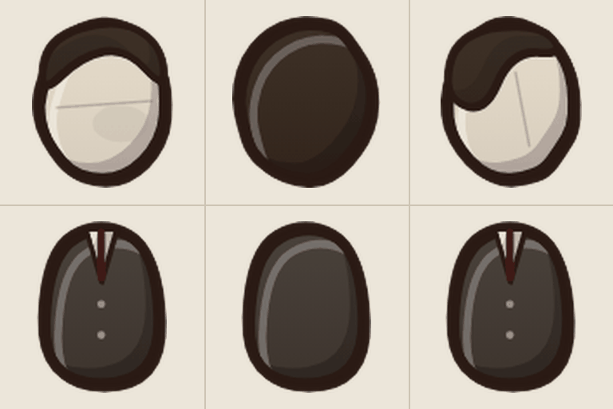
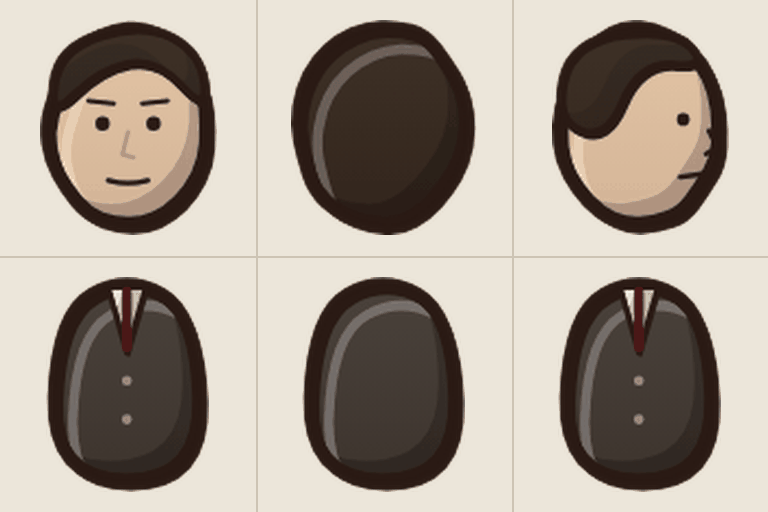
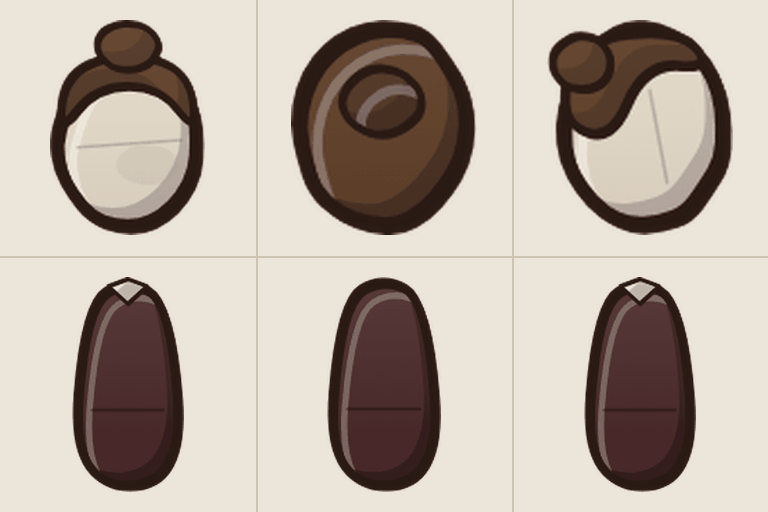
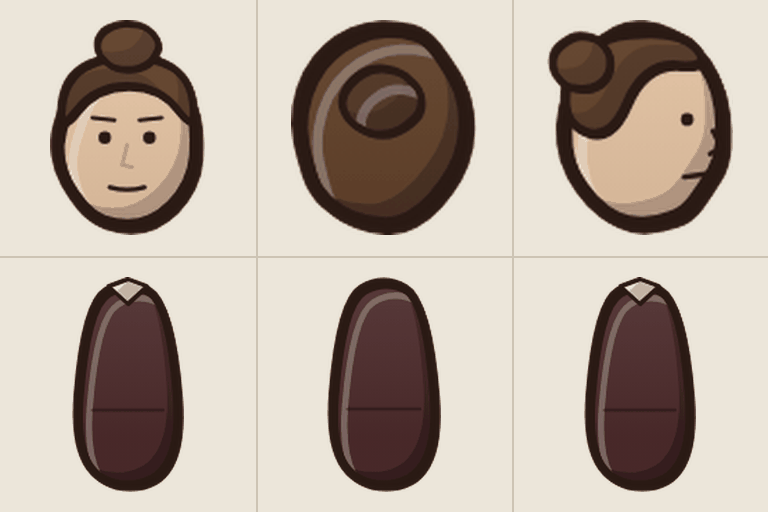
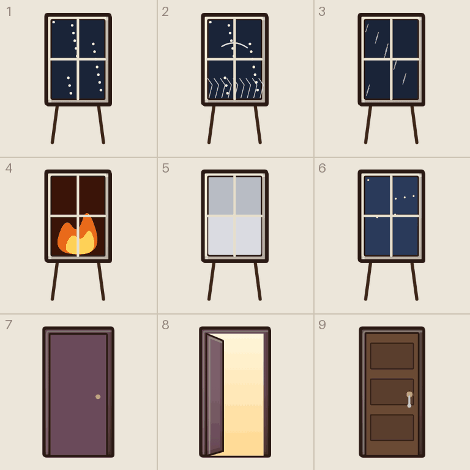
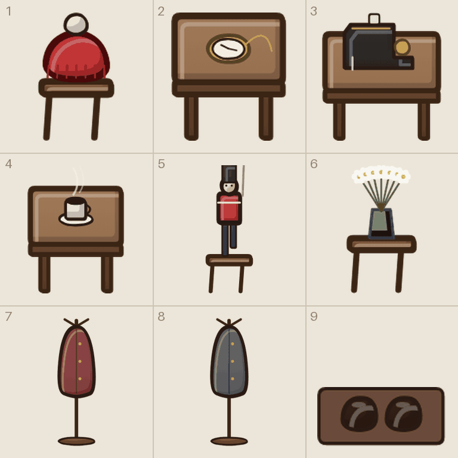
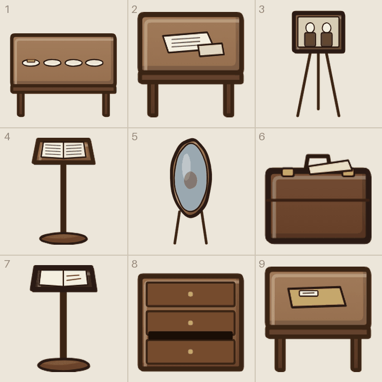
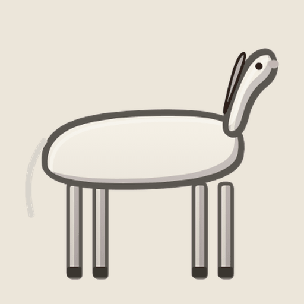

# Tegneliste 7: Drømmene

Laget av `tools/lag_tegnelister.py`. Ikke rediger for hånd; kjør skriptet på nytt når bilder er levert, så forsvinner det som er ferdig.

Minnene, tegnene som går igjen, døra og figurene uten ansikt. Litt mykere og blekere enn resten, som et gammelt fotografi. Tegn mannen og kvinnen uten ansikt først og versjonen med ansikt rett etter, i samme samtale, så klærne blir like.

## Slik gjør du det

1. Start en ny samtale i ChatGPT og lim inn stilblokken under. Bruk samme samtale for hele lista, så stilen holder seg.
2. For hvert ark: last opp malen fra `maler/` (står ved arket), og referansebildet hvis det står et. Lim inn prompten.
3. Last ned resultatet som PNG og gi det nøyaktig filnavnet som står ved arket.
4. Last fila opp til `gpt-grafikk/` i repoet (Add file, Upload files) og commit til `main`. Resten går av seg selv.

## Stilblokk (lim inn først)

```text
Style: hand-drawn cartoon game art in the style of Conan Chop Chop mixed with Castle Crashers. Thick dark brown ink outlines (#2a1a14) with a slightly wobbly, hand-inked line that is heavier on the lower right. Flat colors with one darker cel-shade tone on the lower right and a small light highlight on the upper left. Light always comes from the upper left. Muted, warm 1920s palette. Setting: a 1920s Norwegian sanatorium, Lovecraftian and a bit gross, but with dark humor. Big heads, small bodies, chunky shapes. Keep this exact style, line thickness and palette for every image in this conversation.
Technical: PNG with a TRANSPARENT background. No text unless asked, no ground shadows, no frames, no background scenery.
```

## 7a. Mannen uten ansikt (figurark)

Filnavn: `figur_blank_m.png`

Mal: `maler/mal_figur.png`

Gir: `hode_blank_m_f/b/s` og `kropp_blank_m_f/b/s`

Referanse (last opp sammen med malen): `tegnelister/referanse/ref_figur_blank_m.png`



```text
Using the attached template (mal_figur.png), draw the character described below in a 3 x 2 grid.
Top row: the HEAD ONLY (no neck, no body): front view, back view, and side view facing right. Each head fills the dashed circle and rests on the + mark.
Bottom row: the TORSO AND HIPS ONLY (no head, no arms, no legs), fitted to the dashed shape. The shoulders must sit on the magenta dots, because the game attaches the arms there.
Keep every drawing inside its own cell. Do not draw the magenta guides.
The face is a completely blank sheet of paper: no eyes, no nose, no mouth, no shading at all. Everything else is drawn normally.
The second attached image shows the placeholder drawings the game uses today, in the same cells. Use it only to see what goes where and roughly how it is posed; redraw everything properly in our style.
Character: a man in a dark 1910s suit and tie whose face is a blank sheet of paper with no features at all, dark combed hair (a figure in a dream).
```

## 7b. Mannen med ansikt (figurark)

Filnavn: `figur_ansikt_m.png`

Mal: `maler/mal_figur.png`

Gir: `hode_ansikt_m_f/b/s` og `kropp_ansikt_m_f/b/s`

Referanse (last opp sammen med malen): `tegnelister/referanse/ref_figur_ansikt_m.png`



```text
Using the attached template (mal_figur.png), draw the character described below in a 3 x 2 grid.
Top row: the HEAD ONLY (no neck, no body): front view, back view, and side view facing right. Each head fills the dashed circle and rests on the + mark.
Bottom row: the TORSO AND HIPS ONLY (no head, no arms, no legs), fitted to the dashed shape. The shoulders must sit on the magenta dots, because the game attaches the arms there.
Keep every drawing inside its own cell. Do not draw the magenta guides.
Exactly the same clothes, hair and build as the faceless version drawn earlier in this conversation, so the game can swap one for the other.
The second attached image shows the placeholder drawings the game uses today, in the same cells. Use it only to see what goes where and roughly how it is posed; redraw everything properly in our style.
Character: the same man in a dark 1910s suit, but now with an ordinary, gentle, slightly sad face.
```

## 7c. Kvinnen uten ansikt (figurark)

Filnavn: `figur_blank_k.png`

Mal: `maler/mal_figur.png`

Gir: `hode_blank_k_f/b/s` og `kropp_blank_k_f/b/s`

Referanse (last opp sammen med malen): `tegnelister/referanse/ref_figur_blank_k.png`



```text
Using the attached template (mal_figur.png), draw the character described below in a 3 x 2 grid.
Top row: the HEAD ONLY (no neck, no body): front view, back view, and side view facing right. Each head fills the dashed circle and rests on the + mark.
Bottom row: the TORSO AND HIPS ONLY (no head, no arms, no legs), fitted to the dashed shape. The shoulders must sit on the magenta dots, because the game attaches the arms there.
Keep every drawing inside its own cell. Do not draw the magenta guides.
The face is a completely blank sheet of paper: no eyes, no nose, no mouth, no shading at all. Everything else is drawn normally.
The second attached image shows the placeholder drawings the game uses today, in the same cells. Use it only to see what goes where and roughly how it is posed; redraw everything properly in our style.
Character: a woman in a long dark red dress with a white collar and her hair in a bun, whose face is a blank sheet of paper with no features at all (a figure in a dream).
```

## 7d. Kvinnen med ansikt (figurark)

Filnavn: `figur_ansikt_k.png`

Mal: `maler/mal_figur.png`

Gir: `hode_ansikt_k_f/b/s` og `kropp_ansikt_k_f/b/s`

Referanse (last opp sammen med malen): `tegnelister/referanse/ref_figur_ansikt_k.png`



```text
Using the attached template (mal_figur.png), draw the character described below in a 3 x 2 grid.
Top row: the HEAD ONLY (no neck, no body): front view, back view, and side view facing right. Each head fills the dashed circle and rests on the + mark.
Bottom row: the TORSO AND HIPS ONLY (no head, no arms, no legs), fitted to the dashed shape. The shoulders must sit on the magenta dots, because the game attaches the arms there.
Keep every drawing inside its own cell. Do not draw the magenta guides.
Exactly the same clothes, hair and build as the faceless version drawn earlier in this conversation, so the game can swap one for the other.
The second attached image shows the placeholder drawings the game uses today, in the same cells. Use it only to see what goes where and roughly how it is posed; redraw everything properly in our style.
Character: the same woman in a long dark red dress, but now with an ordinary, gentle, slightly sad face.
```

## 7e. Vinduene og dørene («ni ting»-ark)

Filnavn: `ark__drom_vindu_sno__drom_vindu_rim__drom_vindu_regn__drom_vindu_brann__drom_vindu_taake__drom_vindu_klart__drom_dor__drom_dor_aapen__drom_dorlaast.png`

Mal: `maler/mal_ni_ting.png`

Gir: 1 `drom_vindu_sno`, 2 `drom_vindu_rim`, 3 `drom_vindu_regn`, 4 `drom_vindu_brann`, 5 `drom_vindu_taake`, 6 `drom_vindu_klart`, 7 `drom_dor`, 8 `drom_dor_aapen`, 9 `drom_dorlaast`

Referanse (last opp sammen med malen): `tegnelister/referanse/ref_drom_vinduer.png`



```text
Using the attached template (mal_ni_ting.png), draw nine separate items, one per cell, read left to right, top to bottom.
Each item sits on the short line with its bottom touching the + mark. Icons, cards and loose body parts are centered in the cell instead. Things that lie flat on the ground are drawn seen from straight above. Keep every drawing inside its own cell. Do not draw the magenta guides.
The six windows are the same freestanding window frame with different weather outside. The three doors are the same door. Soft and a little faded, like an old photograph.
The second attached image shows the placeholder drawings the game uses today, in the same cells. Use it only to see what goes where and roughly how it is posed; redraw everything properly in our style.
Items:
1) a freestanding window frame, snow falling at night outside.
2) a freestanding window frame covered in frost patterns.
3) a freestanding window frame with rain outside.
4) a freestanding window frame with fire outside.
5) a freestanding window frame with thick fog outside.
6) a freestanding window frame with a starry night outside.
7) a closed door in a dark frame.
8) the same door wide open with warm white light pouring out.
9) a closed wooden door with a key in the lock.
```

## 7f. Tingene de etterlot seg («ni ting»-ark)

Filnavn: `ark__drom_lue__drom_ur__drom_symaskin__drom_kopp__drom_soldat__drom_hvitveis__drom_kaape_7a2a2e__drom_kaape_4a4a52__drom_sko.png`

Mal: `maler/mal_ni_ting.png`

Gir: 1 `drom_lue`, 2 `drom_ur`, 3 `drom_symaskin`, 4 `drom_kopp`, 5 `drom_soldat`, 6 `drom_hvitveis`, 7 `drom_kaape_7a2a2e`, 8 `drom_kaape_4a4a52`, 9 `drom_sko`

Referanse (last opp sammen med malen): `tegnelister/referanse/ref_drom_ting.png`



```text
Using the attached template (mal_ni_ting.png), draw nine separate items, one per cell, read left to right, top to bottom.
Each item sits on the short line with its bottom touching the + mark. Icons, cards and loose body parts are centered in the cell instead. Things that lie flat on the ground are drawn seen from straight above. Keep every drawing inside its own cell. Do not draw the magenta guides.
Soft and a little faded, like an old photograph.
The second attached image shows the placeholder drawings the game uses today, in the same cells. Use it only to see what goes where and roughly how it is posed; redraw everything properly in our style.
Items:
1) a red knitted hat lying on a wooden stool.
2) a gold pocket watch on a small wooden table.
3) a black and gold antique sewing machine on a small table.
4) a half-full cup of black coffee with steam, on a small table.
5) a tin soldier in a red coat, missing one foot, standing on a stool.
6) a glass of white wood anemones on a stool.
7) a woman's dark red coat hanging on a coat stand.
8) a man's grey coat hanging on a coat stand.
9) a pair of dry leather shoes on a doormat.
```

## 7g. Bordene, brevene og mappa («ni ting»-ark)

Filnavn: `ark__drom_bord__drom_brev__drom_foto__drom_notat__drom_speil__drom_koffert__drom_bok__drom_kommode__drom_mappe.png`

Mal: `maler/mal_ni_ting.png`

Gir: 1 `drom_bord`, 2 `drom_brev`, 3 `drom_foto`, 4 `drom_notat`, 5 `drom_speil`, 6 `drom_koffert`, 7 `drom_bok`, 8 `drom_kommode`, 9 `drom_mappe`

Referanse (last opp sammen med malen): `tegnelister/referanse/ref_drom_bord.png`



```text
Using the attached template (mal_ni_ting.png), draw nine separate items, one per cell, read left to right, top to bottom.
Each item sits on the short line with its bottom touching the + mark. Icons, cards and loose body parts are centered in the cell instead. Things that lie flat on the ground are drawn seen from straight above. Keep every drawing inside its own cell. Do not draw the magenta guides.
Soft and a little faded, like an old photograph.
The second attached image shows the placeholder drawings the game uses today, in the same cells. Use it only to see what goes where and roughly how it is posed; redraw everything properly in our style.
Items:
1) a kitchen table set for four.
2) a small table with a handwritten letter and an envelope.
3) an old framed photograph of two people on an easel; their faces are blank.
4) a lectern with an open policeman's notebook.
5) a standing oval mirror.
6) a packed brown suitcase with a train ticket on top.
7) a prayer book open on a stand.
8) a wooden chest of drawers with one drawer open.
9) a patient file folder on a small table.
```

## 7h. Den hvite hesten (enkeltbilde)

Filnavn: `drom_hest.png`

Gir: `drom_hest`

Referanse (last opp sammen med prompten): `tegnelister/referanse/ref_drom_hest.png`



```text
Draw ONE image, 1024 x 1024 (square): a white horse standing sideways, calm and slightly unreal.
Seen from the front and slightly above, so it shows its front and a little of its top.
Soft and a little faded, like an old photograph.
Exactly one object, centered and fully visible, not cropped. Transparent background, no ground shadow, no text, no frame.
The attached image shows the placeholder the game uses today. Use it only to see what it is; redraw it properly in our style.
```
