# Tegneliste 8: Møblene i de nye rommene, parken og skogen

Laget av `tools/lag_tegnelister.py`. Ikke rediger for hånd; kjør skriptet på nytt når bilder er levert, så forsvinner det som er ferdig.

Møblene til de nye romtypene, parken og Nattskogen, og utgangene fra hver etasje. Forfra og litt ovenfra, som de andre møblene. Det som ligger flatt på bakken (grav, våk, kloakk, kullsjakt, blomsterbed, hårhaug, teppe) tegnes rett ovenfra. Denne lista kan komme sist; koden tegner møblene godt nok til da.

## Slik gjør du det

1. Start en ny samtale i ChatGPT og lim inn stilblokken under. Bruk samme samtale for hele lista, så stilen holder seg.
2. For hvert ark: last opp malen fra `maler/` (står ved arket), og referansebildet hvis det står et. Lim inn prompten.
3. Last ned resultatet som PNG og gi det nøyaktig filnavnet som står ved arket.
4. Last fila opp til `gpt-grafikk/` i repoet (Add file, Upload files) og commit til `main`. Resten går av seg selv.

## Stilblokk (lim inn først)

```text
Style: hand-drawn cartoon game art in the style of Conan Chop Chop mixed with Castle Crashers. Thick dark brown ink outlines (#2a1a14) with a slightly wobbly, hand-inked line that is heavier on the lower right. Flat colors with one darker cel-shade tone on the lower right and a small light highlight on the upper left. Light always comes from the upper left. Muted, warm 1920s palette. Setting: a 1920s Norwegian sanatorium, Lovecraftian and a bit gross, but with dark humor. Big heads, small bodies, chunky shapes. Keep this exact style, line thickness and palette for every image in this conversation.
Technical: PNG with a TRANSPARENT background. No text unless asked, no ground shadows, no frames, no background scenery.
```

## 8a. Behandlingsrommene («ni ting»-ark)

Filnavn: `ark__prop_elektrostol__prop_spole__prop_rontgen__prop_lysskjerm__prop_tannlegestol__prop_instrumentbord__prop_spyttkum__prop_frisorstol__prop_harhaug.png`

Mal: `maler/mal_ni_ting.png`

Gir: 1 `prop_elektrostol`, 2 `prop_spole`, 3 `prop_rontgen`, 4 `prop_lysskjerm`, 5 `prop_tannlegestol`, 6 `prop_instrumentbord`, 7 `prop_spyttkum`, 8 `prop_frisorstol`, 9 `prop_harhaug`

Referanse (last opp sammen med malen): `tegnelister/referanse/ref_behandling.png`

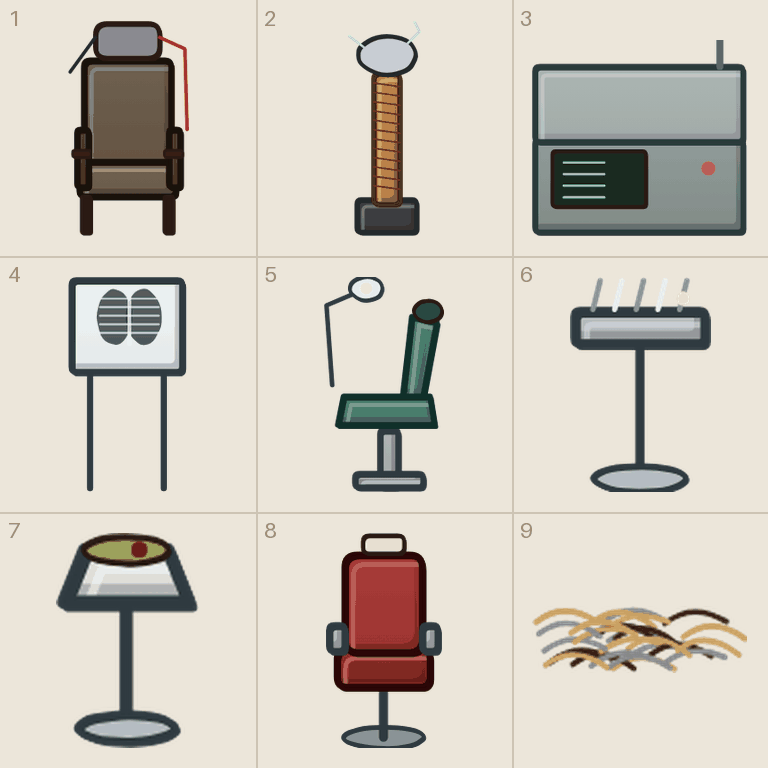

```text
Using the attached template (mal_ni_ting.png), draw nine separate items, one per cell, read left to right, top to bottom.
Each item sits on the short line with its bottom touching the + mark. Icons, cards and loose body parts are centered in the cell instead. Things that lie flat on the ground are drawn seen from straight above. Keep every drawing inside its own cell. Do not draw the magenta guides.
The second attached image shows the placeholder drawings the game uses today, in the same cells. Use it only to see what goes where and roughly how it is posed; redraw everything properly in our style.
Items:
1) an electroshock therapy chair with leather straps and a metal head cap with wires.
2) a tall induction coil on a wooden base with a copper ring on top.
3) a 1920s X-ray machine: a glass tube on a big jointed arm over a stand.
4) an X-ray light box on a stand showing the bones of a hand.
5) an old dentist chair with a drill arm.
6) a small steel instrument table with pliers and probes.
7) a white enamel spittoon on a stand.
8) a barber chair of cracked leather and chrome.
9) a pile of cut hair on the floor, seen from above (flat).
```

## 8b. Salongen og kapellet («ni ting»-ark)

Filnavn: `ark__prop_piano__prop_grammofon__prop_lenestol__prop_kortbord__prop_globus__prop_bjorn__prop_gevir__prop_kors__kiste12.png`

Mal: `maler/mal_ni_ting.png`

Gir: 1 `prop_piano`, 2 `prop_grammofon`, 3 `prop_lenestol`, 4 `prop_kortbord`, 5 `prop_globus`, 6 `prop_bjorn`, 7 `prop_gevir`, 8 `prop_kors`, 9 `kiste12`

Referanse (last opp sammen med malen): `tegnelister/referanse/ref_salong.png`

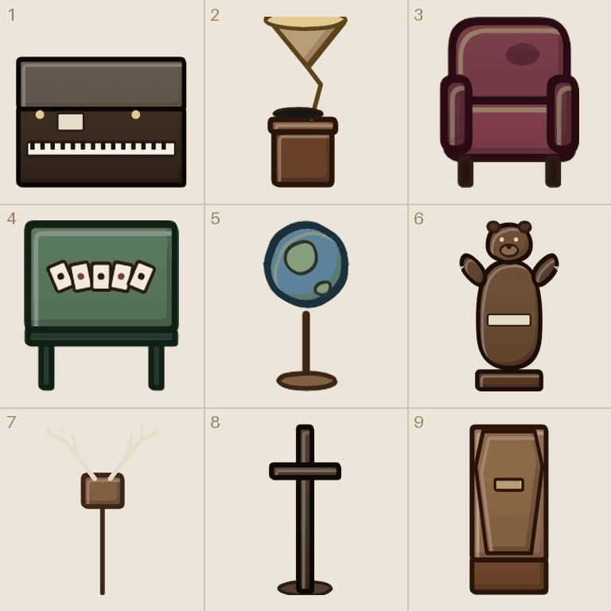

```text
Using the attached template (mal_ni_ting.png), draw nine separate items, one per cell, read left to right, top to bottom.
Each item sits on the short line with its bottom touching the + mark. Icons, cards and loose body parts are centered in the cell instead. Things that lie flat on the ground are drawn seen from straight above. Keep every drawing inside its own cell. Do not draw the magenta guides.
The second attached image shows the placeholder drawings the game uses today, in the same cells. Use it only to see what goes where and roughly how it is posed; redraw everything properly in our style.
Items:
1) an old upright piano with brass candle holders, front view.
2) a 1920s gramophone with a big brass horn on a small wooden cabinet.
3) a worn floral armchair, front view.
4) a small card table with playing cards and a glass of cognac.
5) an old globe on a wooden stand.
6) a stuffed brown bear standing upright with one glass eye missing.
7) deer antlers mounted on a wooden plaque.
8) a tall wooden crucifix.
9) a dark wooden coffin with a slightly raised lid and a small brass name plate, lying lengthwise into the picture (one tile wide, two tiles deep).
```

## 8c. Kjøkkenet og kjelleren («ni ting»-ark)

Filnavn: `ark__prop_komfyr__prop_gryte__prop_kjottkrok__prop_kjele__prop_kullhaug__prop_ror__prop_vedovn__prop_kloakk__prop_kullsjakt.png`

Mal: `maler/mal_ni_ting.png`

Gir: 1 `prop_komfyr`, 2 `prop_gryte`, 3 `prop_kjottkrok`, 4 `prop_kjele`, 5 `prop_kullhaug`, 6 `prop_ror`, 7 `prop_vedovn`, 8 `prop_kloakk`, 9 `prop_kullsjakt`

Referanse (last opp sammen med malen): `tegnelister/referanse/ref_kjokken.png`

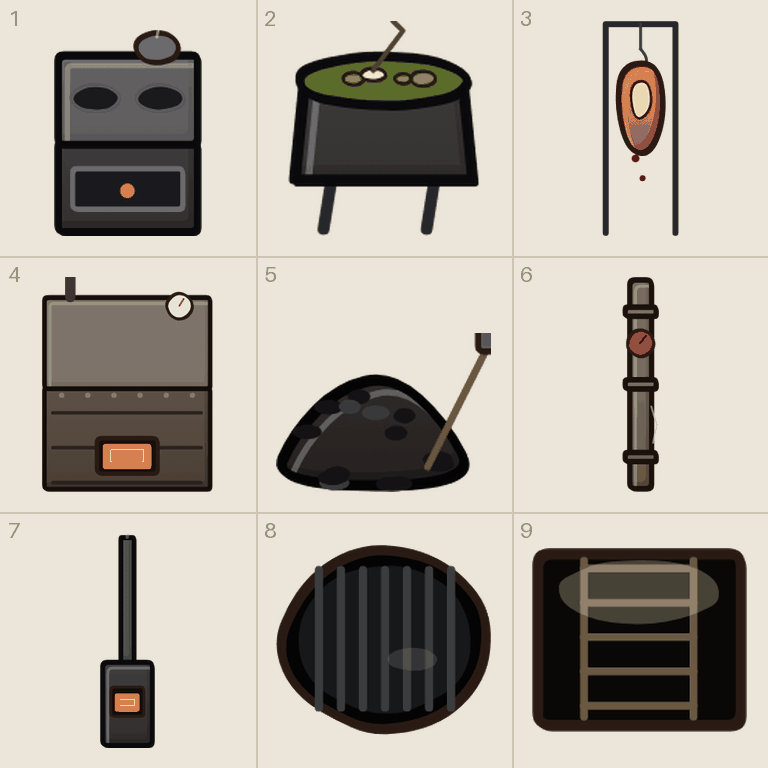

```text
Using the attached template (mal_ni_ting.png), draw nine separate items, one per cell, read left to right, top to bottom.
Each item sits on the short line with its bottom touching the + mark. Icons, cards and loose body parts are centered in the cell instead. Things that lie flat on the ground are drawn seen from straight above. Keep every drawing inside its own cell. Do not draw the magenta guides.
The second attached image shows the placeholder drawings the game uses today, in the same cells. Use it only to see what goes where and roughly how it is posed; redraw everything properly in our style.
Items:
1) a black cast-iron kitchen stove with pots on top.
2) a big steel soup pot.
3) meat hooks on a rail with sausages and a ham.
4) a big iron boiler with pipes, a pressure gauge and a glowing firebox.
5) a heap of coal with a shovel stuck in it.
6) rusty pipes with a valve wheel.
7) a black wood-burning stove with a glowing door.
8) a round sewer grate seen from above (flat), dark water below.
9) a square coal chute hatch in the floor with a ladder, seen from above (flat).
```

## 8d. Drivhuset og hagen («ni ting»-ark)

Filnavn: `ark__prop_plantebord__prop_kjempeplante__prop_vannkanne__prop_busk__prop_blomsterbed__prop_hagenisse__prop_fuglebad__prop_bronn__prop_lyktestolpe.png`

Mal: `maler/mal_ni_ting.png`

Gir: 1 `prop_plantebord`, 2 `prop_kjempeplante`, 3 `prop_vannkanne`, 4 `prop_busk`, 5 `prop_blomsterbed`, 6 `prop_hagenisse`, 7 `prop_fuglebad`, 8 `prop_bronn`, 9 `prop_lyktestolpe`

Referanse (last opp sammen med malen): `tegnelister/referanse/ref_hagen.png`

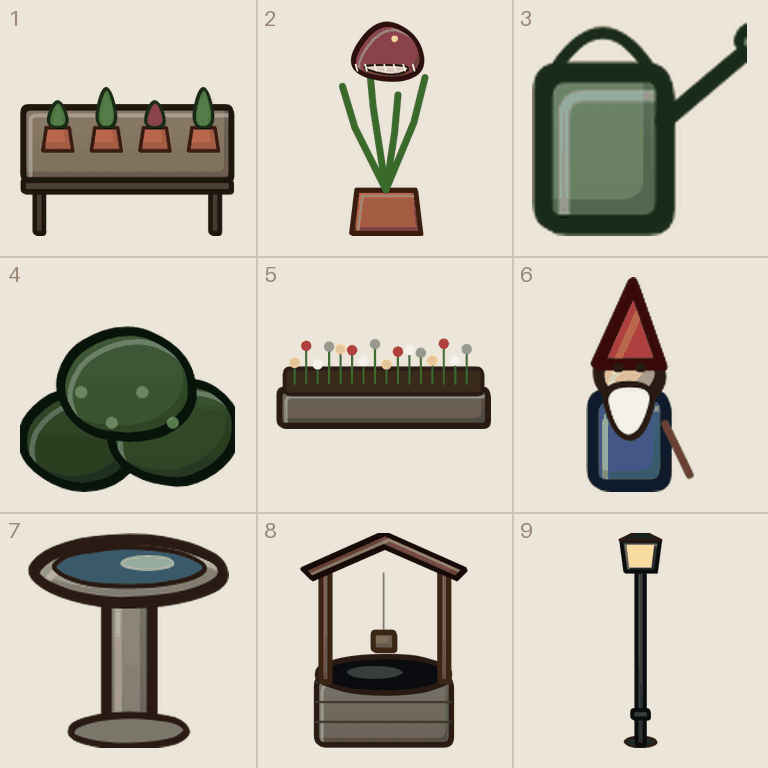

```text
Using the attached template (mal_ni_ting.png), draw nine separate items, one per cell, read left to right, top to bottom.
Each item sits on the short line with its bottom touching the + mark. Icons, cards and loose body parts are centered in the cell instead. Things that lie flat on the ground are drawn seen from straight above. Keep every drawing inside its own cell. Do not draw the magenta guides.
The second attached image shows the placeholder drawings the game uses today, in the same cells. Use it only to see what goes where and roughly how it is posed; redraw everything properly in our style.
Items:
1) a greenhouse potting table with seedlings in clay pots.
2) a giant carnivorous plant with glowing pods.
3) a zinc watering can.
4) a round clipped hedge bush.
5) a flower bed with red and white flowers, seen from above (flat).
6) a garden gnome with a red cap, slightly sinister.
7) a stone birdbath.
8) a stone well with a small wooden roof and a bucket.
9) a cast-iron gas street lamp, lit.
```

## 8e. Kirkegården, dammen og vinteren («ni ting»-ark)

Filnavn: `ark__prop_engel__prop_grav__prop_statue__prop_fontene__prop_siv__prop_vak__prop_snomann__prop_liggestol__prop_teppe.png`

Mal: `maler/mal_ni_ting.png`

Gir: 1 `prop_engel`, 2 `prop_grav`, 3 `prop_statue`, 4 `prop_fontene`, 5 `prop_siv`, 6 `prop_vak`, 7 `prop_snomann`, 8 `prop_liggestol`, 9 `prop_teppe`

Referanse (last opp sammen med malen): `tegnelister/referanse/ref_kirkegard.png`

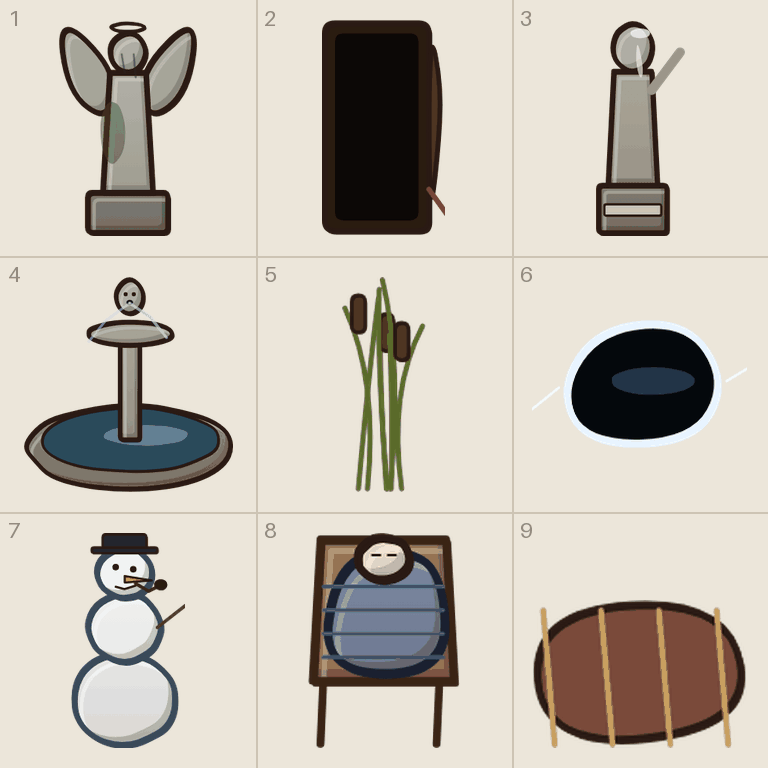

```text
Using the attached template (mal_ni_ting.png), draw nine separate items, one per cell, read left to right, top to bottom.
Each item sits on the short line with its bottom touching the + mark. Icons, cards and loose body parts are centered in the cell instead. Things that lie flat on the ground are drawn seen from straight above. Keep every drawing inside its own cell. Do not draw the magenta guides.
The second attached image shows the placeholder drawings the game uses today, in the same cells. Use it only to see what goes where and roughly how it is posed; redraw everything properly in our style.
Items:
1) a weeping stone angel on a plinth.
2) an open grave with a spade in the dirt pile, seen from above (flat).
3) a classical marble statue of a woman on a plinth.
4) a round stone fountain with water in the basin.
5) a clump of reeds.
6) a black hole in the ice, seen from above (flat).
7) a crooked snowman with coal eyes.
8) a wooden sanatorium deck chair with a plaid blanket.
9) a folded plaid blanket on the ground, flat.
```

## 8f. Nattskogen («ni ting»-ark)

Filnavn: `ark__prop_baal__prop_stubbe__prop_sopp__prop_stein__prop_vedstabel__prop_robat__prop_ruinmur__prop_skilt__prop_kjerre.png`

Mal: `maler/mal_ni_ting.png`

Gir: 1 `prop_baal`, 2 `prop_stubbe`, 3 `prop_sopp`, 4 `prop_stein`, 5 `prop_vedstabel`, 6 `prop_robat`, 7 `prop_ruinmur`, 8 `prop_skilt`, 9 `prop_kjerre`

Referanse (last opp sammen med malen): `tegnelister/referanse/ref_skogen.png`

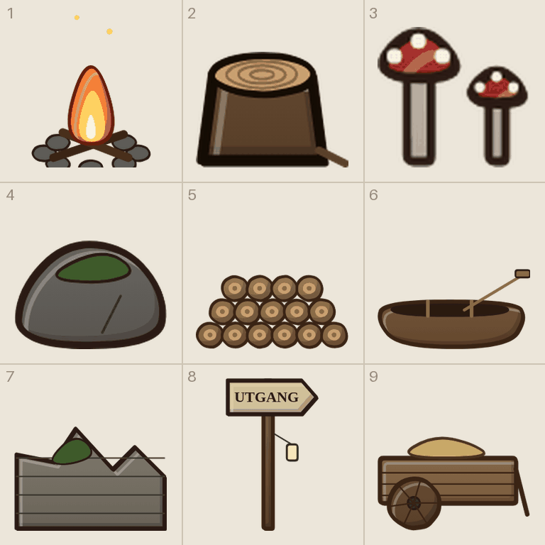

```text
Using the attached template (mal_ni_ting.png), draw nine separate items, one per cell, read left to right, top to bottom.
Each item sits on the short line with its bottom touching the + mark. Icons, cards and loose body parts are centered in the cell instead. Things that lie flat on the ground are drawn seen from straight above. Keep every drawing inside its own cell. Do not draw the magenta guides.
The second attached image shows the placeholder drawings the game uses today, in the same cells. Use it only to see what goes where and roughly how it is posed; redraw everything properly in our style.
Items:
1) a campfire in a ring of stones, burning.
2) a tree stump.
3) two toadstools, red with white dots.
4) a mossy boulder.
5) a stack of firewood.
6) a wooden rowing boat pulled up on land.
7) a crumbling stone ruin wall.
8) a wooden signpost pointing out of a forest.
9) a wooden hand cart.
```

## 8g. Utgangsdøra med lys bak (enkeltbilde)

Filnavn: `prop_utgang.png`

Gir: `prop_utgang`

Referanse (last opp sammen med prompten): `tegnelister/referanse/ref_prop_utgang.png`

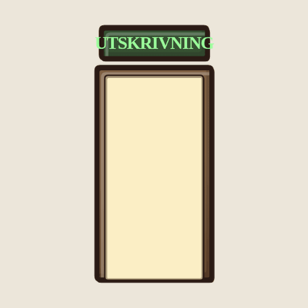

```text
Draw ONE image, 1024 x 1536 (portrait): a lit exit door with bright white light behind it.
Seen from the front and slightly above, so it shows its front and a little of its top.
Exactly one object, centered and fully visible, not cropped. Transparent background, no ground shadow, no text, no frame.
The attached image shows the placeholder the game uses today. Use it only to see what it is; redraw it properly in our style.
```

## 8h. Det åpne vinduet (enkeltbilde)

Filnavn: `prop_vindu.png`

Gir: `prop_vindu`

Referanse (last opp sammen med prompten): `tegnelister/referanse/ref_prop_vindu.png`

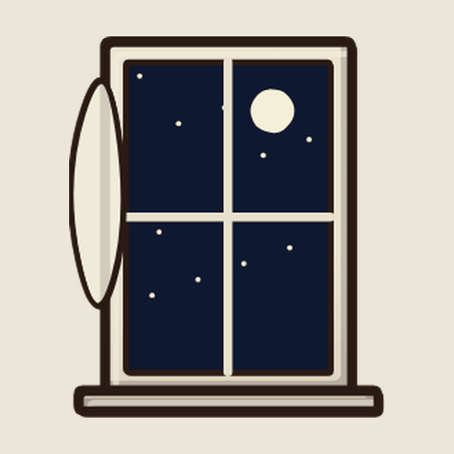

```text
Draw ONE image, 1024 x 1536 (portrait): an open window with a night sky outside.
Seen from the front and slightly above, so it shows its front and a little of its top.
Exactly one object, centered and fully visible, not cropped. Transparent background, no ground shadow, no text, no frame.
The attached image shows the placeholder the game uses today. Use it only to see what it is; redraw it properly in our style.
```

## 8i. Parkporten (enkeltbilde)

Filnavn: `prop_porten.png`

Gir: `prop_porten`

Referanse (last opp sammen med prompten): `tegnelister/referanse/ref_prop_porten.png`

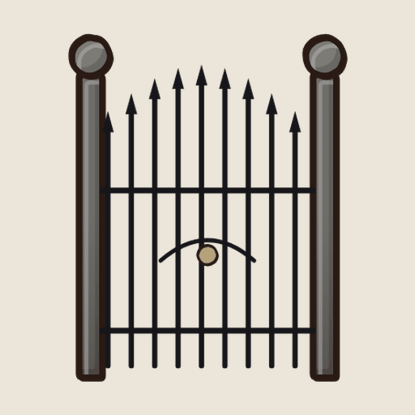

```text
Draw ONE image, 1024 x 1024 (square): a tall wrought-iron park gate, slightly open.
Seen from the front and slightly above, so it shows its front and a little of its top.
Exactly one object, centered and fully visible, not cropped. Transparent background, no ground shadow, no text, no frame.
The attached image shows the placeholder the game uses today. Use it only to see what it is; redraw it properly in our style.
```

## 8j. Langbordet i spisesalen (enkeltbilde)

Filnavn: `prop_langbord.png`

Gir: `prop_langbord`

Referanse (last opp sammen med prompten): `tegnelister/referanse/ref_prop_langbord.png`

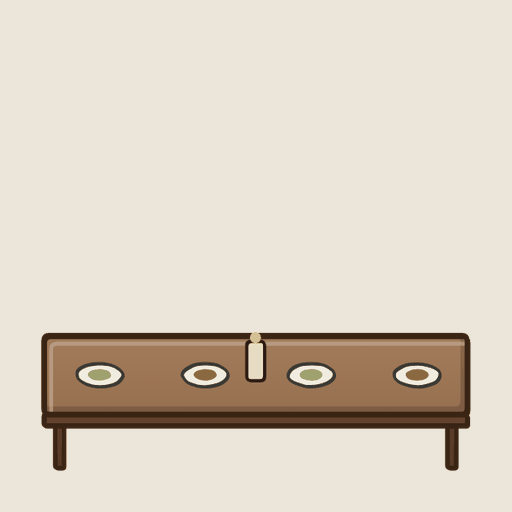

```text
Draw ONE image, 1536 x 1024 (landscape): a long wooden dining-hall table with white plates and cups, front view.
Seen from the front and slightly above, so it shows its front and a little of its top.
Exactly one object, centered and fully visible, not cropped. Transparent background, no ground shadow, no text, no frame.
The attached image shows the placeholder the game uses today. Use it only to see what it is; redraw it properly in our style.
```

## 8k. Parktreet (enkeltbilde)

Filnavn: `prop_tre.png`

Gir: `prop_tre`

Referanse (last opp sammen med prompten): `tegnelister/referanse/ref_prop_tre.png`

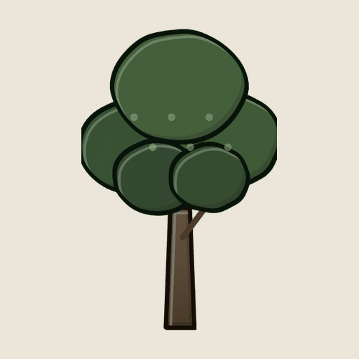

```text
Draw ONE image, 1024 x 1536 (portrait): a large leafy park tree, front view.
Seen from the front and slightly above, so it shows its front and a little of its top.
Exactly one object, centered and fully visible, not cropped. Transparent background, no ground shadow, no text, no frame.
The attached image shows the placeholder the game uses today. Use it only to see what it is; redraw it properly in our style.
```

## 8l. Bjørka (enkeltbilde)

Filnavn: `prop_bjork.png`

Gir: `prop_bjork`

Referanse (last opp sammen med prompten): `tegnelister/referanse/ref_prop_bjork.png`

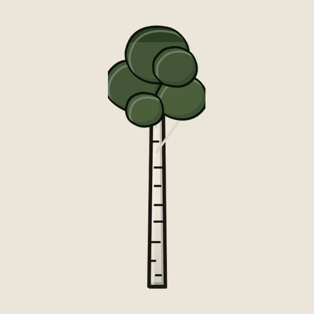

```text
Draw ONE image, 1024 x 1536 (portrait): a tall white birch tree.
Seen from the front and slightly above, so it shows its front and a little of its top.
Exactly one object, centered and fully visible, not cropped. Transparent background, no ground shadow, no text, no frame.
The attached image shows the placeholder the game uses today. Use it only to see what it is; redraw it properly in our style.
```

## 8m. Den døde bjørka (enkeltbilde)

Filnavn: `prop_bjork_dod.png`

Gir: `prop_bjork_dod`

Referanse (last opp sammen med prompten): `tegnelister/referanse/ref_prop_bjork_dod.png`

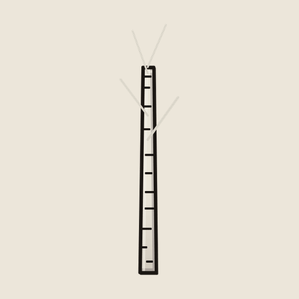

```text
Draw ONE image, 1024 x 1536 (portrait): a dead white birch tree without leaves.
Seen from the front and slightly above, so it shows its front and a little of its top.
Exactly one object, centered and fully visible, not cropped. Transparent background, no ground shadow, no text, no frame.
The attached image shows the placeholder the game uses today. Use it only to see what it is; redraw it properly in our style.
```

## 8n. Lysthuset (enkeltbilde)

Filnavn: `prop_lysthus.png`

Gir: `prop_lysthus`

Referanse (last opp sammen med prompten): `tegnelister/referanse/ref_prop_lysthus.png`

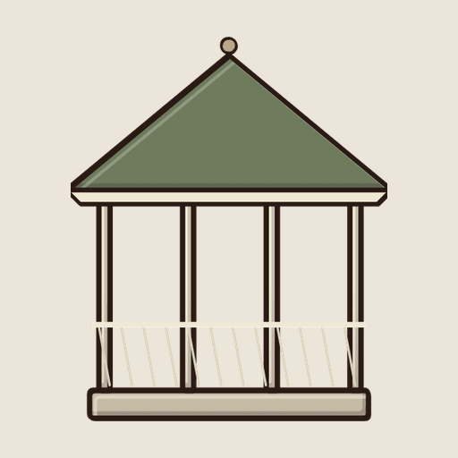

```text
Draw ONE image, 1024 x 1024 (square): a small white wooden gazebo with a pointed roof.
Seen from the front and slightly above, so it shows its front and a little of its top.
Exactly one object, centered and fully visible, not cropped. Transparent background, no ground shadow, no text, no frame.
The attached image shows the placeholder the game uses today. Use it only to see what it is; redraw it properly in our style.
```
