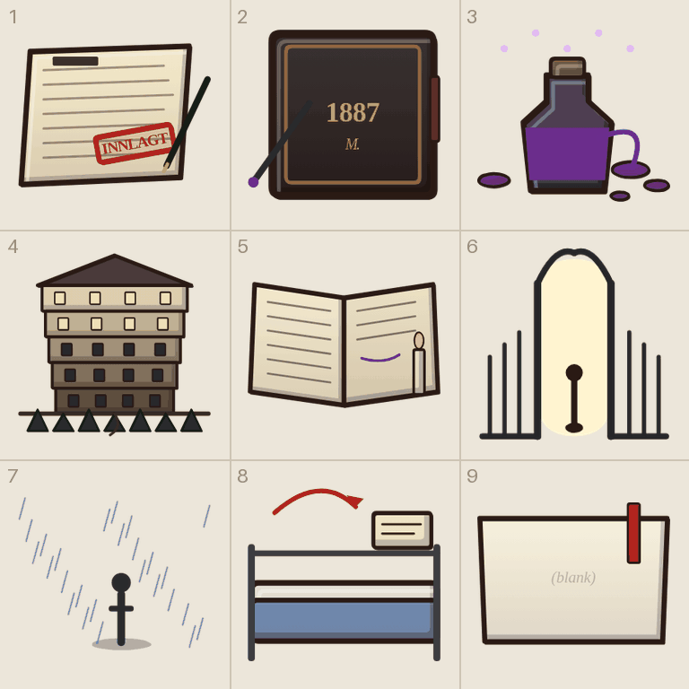

# Tegneliste 10: Historien

Laget av `tools/lag_tegnelister.py`. Ikke rediger for hånd; kjør skriptet på nytt når bilder er levert, så forsvinner det som er ferdig.

Bildene til historien (src/41_historie.js): journalsidene før drømmene, de fire sluttene og forstanderen som sitter i Dypet og leser. Alt vises stort i samtalepanelet. Journalsidene er stilleben, ting og ikke folk, litt mørkere og mer høytidelige enn resten. Forstanderen står også i etasjen, så han tegnes forfra som møblene og som eget bilde.

## Slik gjør du det

1. Start en ny samtale i ChatGPT og lim inn stilblokken under. Bruk samme samtale for hele lista, så stilen holder seg.
2. For hvert ark: last opp malen fra `maler/` (står ved arket), og referansebildet hvis det står et. Lim inn prompten.
3. Last ned resultatet som PNG og gi det nøyaktig filnavnet som står ved arket.
4. Last fila opp til `gpt-grafikk/` i repoet (Add file, Upload files) og commit til `main`. Resten går av seg selv.

## Stilblokk (lim inn først)

```text
Style: hand-drawn cartoon game art in the style of Conan Chop Chop mixed with Castle Crashers. Thick dark brown ink outlines (#2a1a14) with a slightly wobbly, hand-inked line that is heavier on the lower right. Flat colors with one darker cel-shade tone on the lower right and a small light highlight on the upper left. Light always comes from the upper left. Muted, warm 1920s palette. Setting: a 1920s Norwegian sanatorium, Lovecraftian and a bit gross, but with dark humor. Big heads, small bodies, chunky shapes. Keep this exact style, line thickness and palette for every image in this conversation.
Technical: PNG with a TRANSPARENT background. No text unless asked, no ground shadows, no frames, no background scenery.
```

## 10a. Journalsidene og sluttene («ni ting»-ark)

Filnavn: `ark__historie_1__historie_2__historie_3__historie_4__historie_5__historie_slutt_tilgivelse__historie_slutt_sannheten__historie_slutt_gjentakelse__historie_slutt_fornektelse.png`

Mal: `maler/mal_ni_ting.png`

Gir: 1 `historie_1`, 2 `historie_2`, 3 `historie_3`, 4 `historie_4`, 5 `historie_5`, 6 `historie_slutt_tilgivelse`, 7 `historie_slutt_sannheten`, 8 `historie_slutt_gjentakelse`, 9 `historie_slutt_fornektelse`

Referanse (last opp sammen med malen): `tegnelister/referanse/ref_historien.png`



```text
Using the attached template (mal_ni_ting.png), draw nine separate items, one per cell, read left to right, top to bottom.
Each item sits on the short line with its bottom touching the + mark. Icons, cards and loose body parts are centered in the cell instead. Things that lie flat on the ground are drawn seen from straight above. Keep every drawing inside its own cell. Do not draw the magenta guides.
Cells 1 to 5 are still lifes of objects, no people, lit by warm candlelight from the upper left. Cells 6 to 9 are the four endings: small, quiet scenes with at most one tiny figure seen from far away.
The second attached image shows the placeholder drawings the game uses today, in the same cells. Use it only to see what goes where and roughly how it is posed; redraw everything properly in our style.
Items:
1) a hospital admission form from 1923: a sheet of yellowed paper with rows of handwritten lines, a red rectangular rubber-stamp mark at an angle, and a black fountain pen lying across it, seen slightly from above.
2) a thick journal bound in cracked black leather, closed, with a dark red ribbon bookmark hanging out, and an old dip pen with one drop of purple ink beside it (the only text allowed: a faded gold 1887 and the initial M. on the cover).
3) an old glass inkwell full of glowing purple ink, the ink creeping out over the rim as if it were alive, with a few purple drops and small pale violet sparks around it.
4) a cutaway of the sanatorium: a small roof on top and five floors stacked downwards, each floor darker than the one above, warm lit windows at the top and dark windows further down, and under the foundation a black pine forest growing into the earth.
5) an open journal lying flat, the left page full of handwritten lines, the right page only half written with the last line trailing off in purple ink, and a burning candle stub beside it.
6) an open iron gate seen from the front with warm white light behind it, and a small dark figure walking out through it.
7) a lone figure standing still in the rain on a stone quay, seen small from behind, a puddle reflecting pale grey light.
8) a freshly made iron hospital bed with a blue blanket, a new admission form lying on the pillow, and a red curved arrow looping back to where it started.
9) a blank sheet of paper with nothing written on it, with a red ribbon bookmark lying across it.
```

## 10b. prop_forstander (enkeltbilde)

Filnavn: `prop_forstander.png`

Gir: `prop_forstander`

Referanse (last opp sammen med prompten): `tegnelister/referanse/ref_prop_forstander.png`


```text
Draw ONE image, 1024 x 1024 (square): an old man with a white beard in a long dark frock coat sitting behind an oversized wooden desk, reading a thick black leather journal that lies open in front of him, a green glass banker's lamp on the desk and dust on his shoulders, seen from the front.
Seen from the front and slightly above, so it shows its front and a little of its top.
He is a quiet, tired old man, not a villain. The desk is far too big for him.
Exactly one object, centered and fully visible, not cropped. Transparent background, no ground shadow, no text, no frame.
The attached image shows the placeholder the game uses today. Use it only to see what it is; redraw it properly in our style.
```
