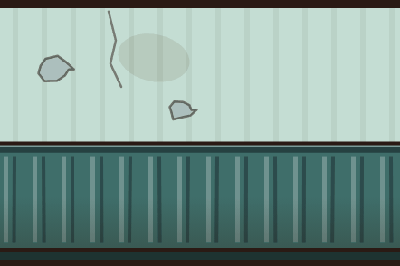
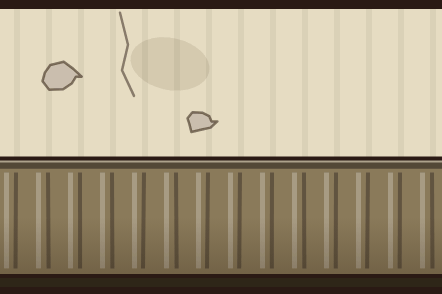
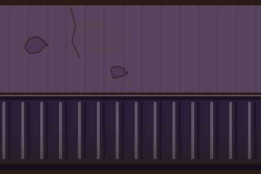
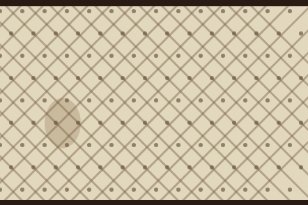
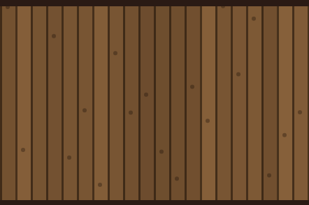
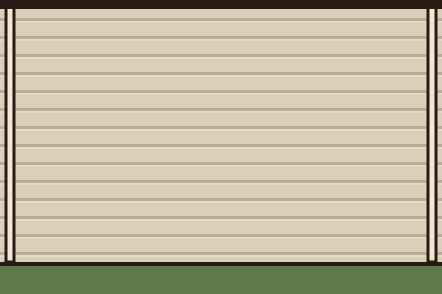
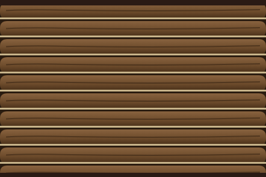
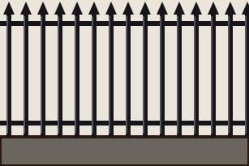
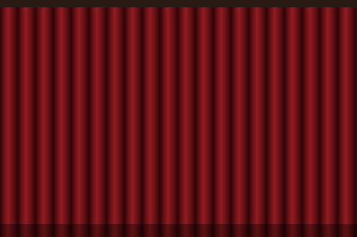

# Tegneliste 11: Veggene

Laget av `tools/lag_tegnelister.py`. Ikke rediger for hånd; kjør skriptet på nytt når bilder er levert, så forsvinner det som er ferdig.

Skal ChatGPT tegne vegger og gulv, så det ser bedre ut? Ja for veggene, og det kan begynne nå. Uteflatene (gulvene ute, snøen, hekken, steinmuren, skogkanten og ruinen) ble levert 27.9. og er i spillet, så de står ikke her. Veggene tegnes i omtrent den oppløsningen skjermen viser dem i, så detaljene fra ChatGPT kommer med, og i dag gjentar hver vegg de samme flekkene annenhver rute (se veggen i kafeteriaen). Gulvene i liste 12 må vente til gulvet tegnes med egne fliser i spillet. I dag males hele gulvet inn i ett stort bilde med 24 til 32 punkter per rute, så et gulv fra ChatGPT ville blitt presset ned til noe uskarpt. Teppet og drivhusglasset tegnes fortsatt av koden. Den mørke gangen på skjermbilde 9 kommer av lyset og ikke av teksturene, så den blir ikke lysere av nye bilder; det er en egen oppgave. Bruk en egen ChatGPT-samtale med stilblokken for teksturer under, ikke den vanlige. Referansebildet viser dagens tegning i samme målestokk, og bildeløpet retter kanter som ikke går helt i ett.

## Slik gjør du det

1. Start en ny samtale i ChatGPT og lim inn stilblokken for teksturer under (ikke den vanlige). Bruk samme samtale for hele lista, så stilen holder seg.
2. For hvert bilde: last opp referansebildet som står ved det, og lim inn prompten. Det trengs ingen mal.
3. Last ned resultatet som PNG og gi det nøyaktig filnavnet som står ved bildet.
4. Last fila opp til `gpt-grafikk/` i repoet (Add file, Upload files) og commit til `main`. Resten går av seg selv: bildet skaleres, kantene rettes hvis de ikke går helt i ett, og det lagres som WebP.

## Stilblokk for teksturer (lim inn først)

```text
Style: hand-painted cartoon game TEXTURES in the style of Conan Chop Chop mixed with Castle Crashers, for a 1923 Norwegian sanatorium (Lovecraftian, a bit gross, darkly funny). Dark brown ink lines (#2a1a14), slightly wobbly and hand-inked but thinner and calmer than on the characters, so figures stay readable on top. Flat muted warm colours with one darker cel-shade tone; every tile, board, brick or stone has a thin light edge on the upper left and a darker edge on the lower right. Mid values only: no large pure-black or pure-white areas. Even, flat lighting over the whole image: no vignette, no light pools, no cast shadows, no perspective, no blur, no photo texture. Fully OPAQUE image (transparency only where the prompt says so). No text, no signature, no frame, no objects lying on the surface. Keep the same style, line weight and scale for every texture in this conversation.
```

## 11a. Panelveggen i Underetasjen (tekstur)

Filnavn: `vegg_panel_3.png`

Gir: `vegg_panel_3`

Brukes i: de samme veggene i Underetasjen. Blir 442 x 294 punkter i spillet.

Referanse (last opp sammen med prompten): `tegnelister/referanse/ref_vegg_panel_3.png`



```text
WALL texture vegg_panel_3: straight-on front view of a wall section exactly 1.5 times as wide as it is tall. The bottom edge is where the wall meets the floor and the top edge is the top of the wall: no floor, no ceiling, no sky. It must tile seamlessly from left to right only. No doors, windows, lamps, pictures, furniture or signs, and no black band at the top or bottom (the game adds the ink edge). Rails must sit where the game's 3D mouldings are: skirting 0-7 percent, dado rail 43-46 percent, cornice band 94-100 percent. Exactly the same layout as vegg_panel, only these colours: plaster #c4ddd3, wainscot #3f6e6a, skirting #1e3331 (a damp hydrotherapy basement). Landscape, 1536 x 1024.
The attached image shows how the game paints this surface today, over the same area. Use it only for the layout and the scale; paint it properly in the texture style.
```

## 11b. Panelveggen i Kjelleren (tekstur)

Filnavn: `vegg_panel_4.png`

Gir: `vegg_panel_4`

Brukes i: de samme veggene i Kjelleren. Blir 442 x 294 punkter i spillet.

Referanse (last opp sammen med prompten): `tegnelister/referanse/ref_vegg_panel_4.png`



```text
WALL texture vegg_panel_4: straight-on front view of a wall section exactly 1.5 times as wide as it is tall. The bottom edge is where the wall meets the floor and the top edge is the top of the wall: no floor, no ceiling, no sky. It must tile seamlessly from left to right only. No doors, windows, lamps, pictures, furniture or signs, and no black band at the top or bottom (the game adds the ink edge). Rails must sit where the game's 3D mouldings are: skirting 0-7 percent, dado rail 43-46 percent, cornice band 94-100 percent. Exactly the same layout as vegg_panel, only these colours: plaster #e6dcc2, wainscot #8a7a5a, skirting #2e2618 (a dusty archive cellar). Landscape, 1536 x 1024.
The attached image shows how the game paints this surface today, over the same area. Use it only for the layout and the scale; paint it properly in the texture style.
```

## 11c. Panelveggen i Dypet (tekstur)

Filnavn: `vegg_panel_6.png`

Gir: `vegg_panel_6`

Brukes i: de samme veggene i Dypet. Blir 442 x 294 punkter i spillet.

Referanse (last opp sammen med prompten): `tegnelister/referanse/ref_vegg_panel_6.png`



```text
WALL texture vegg_panel_6: straight-on front view of a wall section exactly 1.5 times as wide as it is tall. The bottom edge is where the wall meets the floor and the top edge is the top of the wall: no floor, no ceiling, no sky. It must tile seamlessly from left to right only. No doors, windows, lamps, pictures, furniture or signs, and no black band at the top or bottom (the game adds the ink edge). Rails must sit where the game's 3D mouldings are: skirting 0-7 percent, dado rail 43-46 percent, cornice band 94-100 percent. Exactly the same layout as vegg_panel, only these colours: plaster #57445f, wainscot #2c1d36, skirting #140c1a (dim, violet and a little wet). Landscape, 1536 x 1024.
The attached image shows how the game paints this surface today, over the same area. Use it only for the layout and the scale; paint it properly in the texture style.
```

## 11d. Den polstrede veggen (tekstur)

Filnavn: `vegg_polstret.png`

Gir: `vegg_polstret`

Brukes i: isolatet. Blir 442 x 294 punkter i spillet.

Referanse (last opp sammen med prompten): `tegnelister/referanse/ref_vegg_polstret.png`



```text
WALL texture vegg_polstret: straight-on front view of a wall section exactly 1.5 times as wide as it is tall. The bottom edge is where the wall meets the floor and the top edge is the top of the wall: no floor, no ceiling, no sky. It must tile seamlessly from left to right only. No doors, windows, lamps, pictures, furniture or signs, and no black band at the top or bottom (the game adds the ink edge). Quilted padded canvas (#e2d8be), diagonal tufting forming diamonds about 25 cm wide, a cloth button at every crossing, a few brown stains, one torn seam with stuffing. Landscape, 1536 x 1024.
The attached image shows how the game paints this surface today, over the same area. Use it only for the layout and the scale; paint it properly in the texture style.
```

## 11e. Treveggen (tekstur)

Filnavn: `vegg_tre.png`

Gir: `vegg_tre`

Brukes i: vaktmesteren og vaktboden. Blir 442 x 294 punkter i spillet.

Referanse (last opp sammen med prompten): `tegnelister/referanse/ref_vegg_tre.png`



```text
WALL texture vegg_tre: straight-on front view of a wall section exactly 1.5 times as wide as it is tall. The bottom edge is where the wall meets the floor and the top edge is the top of the wall: no floor, no ceiling, no sky. It must tile seamlessly from left to right only. No doors, windows, lamps, pictures, furniture or signs, and no black band at the top or bottom (the game adds the ink edge). Vertical board-and-batten, boards about 17 cm wide, #6a4a2c to #86603a, dark gaps, a few knots and nail heads. Landscape, 1536 x 1024.
The attached image shows how the game paints this surface today, over the same area. Use it only for the layout and the scale; paint it properly in the texture style.
```

## 11f. Paviljongveggen (tekstur)

Filnavn: `vegg_paviljong.png`

Gir: `vegg_paviljong`

Brukes i: paviljongene i Parken. Blir 442 x 294 punkter i spillet.

Referanse (last opp sammen med prompten): `tegnelister/referanse/ref_vegg_paviljong.png`



```text
WALL texture vegg_paviljong: straight-on front view of a wall section exactly 1.5 times as wide as it is tall. The bottom edge is where the wall meets the floor and the top edge is the top of the wall: no floor, no ceiling, no sky. It must tile seamlessly from left to right only. No doors, windows, lamps, pictures, furniture or signs, and no black band at the top or bottom (the game adds the ink edge). Rails must sit where the game's 3D mouldings are: skirting 0-7 percent, dado rail 43-46 percent, cornice band 94-100 percent. Layout from the bottom: 0-7% a green-painted base (#5e7a4a) with a dark top edge; 7-100% white horizontal clapboard (#d8d0b8), boards about 14 cm high with a thin shadow under each, crossed by a flat white-painted rail at 43-46% and a white cornice board at 94-100%; no corner posts. Landscape, 1536 x 1024.
The attached image shows how the game paints this surface today, over the same area. Use it only for the layout and the scale; paint it properly in the texture style.
```

## 11g. Tømmerveggen (tekstur)

Filnavn: `vegg_tommer.png`

Gir: `vegg_tommer`

Brukes i: koiene i Nattskogen. Blir 442 x 294 punkter i spillet.

Referanse (last opp sammen med prompten): `tegnelister/referanse/ref_vegg_tommer.png`



```text
WALL texture vegg_tommer: straight-on front view of a wall section exactly 1.5 times as wide as it is tall. The bottom edge is where the wall meets the floor and the top edge is the top of the wall: no floor, no ceiling, no sky. It must tile seamlessly from left to right only. No doors, windows, lamps, pictures, furniture or signs, and no black band at the top or bottom (the game adds the ink edge). Round horizontal logs, about 4 per metre, lit on top (#8a6440) and dark underneath (#3e2814), pale chinking (#c8b48a) between them, cracks and knots, no log ends. Landscape, 1536 x 1024.
The attached image shows how the game paints this surface today, over the same area. Use it only for the layout and the scale; paint it properly in the texture style.
```

## 11h. Smijernsgjerdet (tekstur)

Filnavn: `vegg_gjerde.png`

Gir: `vegg_gjerde`

Brukes i: liggehallen. Blir 307 x 205 punkter i spillet.

Referanse (last opp sammen med prompten): `tegnelister/referanse/ref_vegg_gjerde.png`



```text
WALL texture vegg_gjerde: straight-on front view of a wall section exactly 1.5 times as wide as it is tall. The bottom edge is where the wall meets the floor and the top edge is the top of the wall: no floor, no ceiling, no sky. It must tile seamlessly from left to right only. No doors, windows, lamps, pictures, furniture or signs. A wrought-iron fence (#16161a) with spear-tipped bars, about 6 per metre, and two horizontal rails, on a grey stone base (#6a665e) along the bottom 22%. EXCEPTION to the style block: TRANSPARENT between and above the bars. Landscape, 1536 x 1024.
The attached image shows how the game paints this surface today, over the same area. Use it only for the layout and the scale; paint it properly in the texture style.
```

## 11i. De røde forhengene (tekstur)

Filnavn: `vegg_forheng.png`

Gir: `vegg_forheng`

Brukes i: drømmen i kapittel 5. Blir 442 x 294 punkter i spillet.

Referanse (last opp sammen med prompten): `tegnelister/referanse/ref_vegg_forheng.png`



```text
WALL texture vegg_forheng: straight-on front view of a wall section exactly 1.5 times as wide as it is tall. The bottom edge is where the wall meets the floor and the top edge is the top of the wall: no floor, no ceiling, no sky. It must tile seamlessly from left to right only. No doors, windows, lamps, pictures, furniture or signs, and no black band at the top or bottom (the game adds the ink edge). Heavy deep-red velvet curtains (#5a0a0e) in vertical folds with lit ridges (#c82c34), floor length, dreamlike and a little wrong; the fold rhythm continues across the left and right edges. Landscape, 1536 x 1024.
The attached image shows how the game paints this surface today, over the same area. Use it only for the layout and the scale; paint it properly in the texture style.
```
