# Tegneliste 11: Veggene og bakken ute

Laget av `tools/lag_tegnelister.py`. Ikke rediger for hånd; kjør skriptet på nytt når bilder er levert, så forsvinner det som er ferdig.

Skal ChatGPT tegne vegger og gulv, så det ser bedre ut? Ja for veggene og bakken ute, og det kan begynne nå. Veggene tegnes i omtrent den oppløsningen skjermen viser dem i, så detaljene fra ChatGPT kommer med, og i dag gjentar hver vegg de samme flekkene annenhver rute (se veggen i kafeteriaen). Gulvene i liste 12 må vente til gulvet tegnes med egne fliser i spillet. I dag males hele gulvet inn i ett stort bilde med 24 til 32 punkter per rute, så et gulv fra ChatGPT ville blitt presset ned til noe uskarpt. Teppet og drivhusglasset tegnes fortsatt av koden. Den mørke gangen på skjermbilde 9 kommer av lyset og ikke av teksturene, så den blir ikke lysere av nye bilder; det er en egen oppgave. Bruk en egen ChatGPT-samtale med stilblokken for teksturer under, ikke den vanlige. Bestill prøven først (Panelveggen, Flisveggen, Murveggen, Hekken og Bakken i Parken), og vis bildene til Claude før resten, så de kan sjekkes på mobil og PC. Referansebildet viser dagens tegning i samme målestokk, og bildeløpet retter kanter som ikke går helt i ett.

## Slik gjør du det

1. Start en ny samtale i ChatGPT og lim inn stilblokken for teksturer under (ikke den vanlige). Bruk samme samtale for hele lista, så stilen holder seg.
2. For hvert bilde: last opp referansebildet som står ved det, og lim inn prompten. Det trengs ingen mal.
3. Last ned resultatet som PNG og gi det nøyaktig filnavnet som står ved bildet.
4. Last fila opp til `gpt-grafikk/` i repoet (Add file, Upload files) og commit til `main`. Resten går av seg selv: bildet skaleres, kantene rettes hvis de ikke går helt i ett, og det lagres som WebP.

## Stilblokk for teksturer (lim inn først)

```text
Style: hand-painted cartoon game TEXTURES in the style of Conan Chop Chop mixed with Castle Crashers, for a 1923 Norwegian sanatorium (Lovecraftian, a bit gross, darkly funny). Dark brown ink lines (#2a1a14), slightly wobbly and hand-inked but thinner and calmer than on the characters, so figures stay readable on top. Flat muted warm colours with one darker cel-shade tone; every tile, board, brick or stone has a thin light edge on the upper left and a darker edge on the lower right. Mid values only: no large pure-black or pure-white areas. Even, flat lighting over the whole image: no vignette, no light pools, no cast shadows, no perspective, no blur, no photo texture. Fully OPAQUE image (transparency only where the prompt says so). No text, no signature, no frame, no objects lying on the surface. Keep the same style, line weight and scale for every texture in this conversation.
```

## 11a. Panelveggen (tekstur)

Filnavn: `vegg_panel.png`

Gir: `vegg_panel`

Brukes i: korridorene, venterom, arkiv, kartotek, journalrom, spisesal, kafeteria og sjefsrommene i Mottaket. Blir 442 x 294 punkter i spillet.

Referanse (last opp sammen med prompten): `tegnelister/referanse/ref_vegg_panel.png`

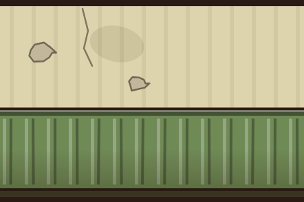

```text
WALL texture vegg_panel: straight-on front view of a wall section exactly 1.5 times as wide as it is tall. The bottom edge is where the wall meets the floor and the top edge is the top of the wall: no floor, no ceiling, no sky. It must tile seamlessly from left to right only. No doors, windows, lamps, pictures, furniture or signs, and no black band at the top or bottom (the game adds the ink edge). Rails must sit where the game's 3D mouldings are: skirting 0-7 percent, dado rail 43-46 percent, cornice band 94-100 percent. Layout from the bottom: 0-7% dark skirting (#3b3322); 7-43% tongue-and-groove wainscot (#6f8a55), narrow vertical boards, each with a light edge; 43-46% a dado rail with a light top edge; 46-94% pale plaster (#ddd4ad) with faint brown water stains, two hairline cracks and a little flaking paint; 94-100% a slightly darker plaster band. Landscape, 1536 x 1024.
The attached image shows how the game paints this surface today, over the same area. Use it only for the layout and the scale; paint it properly in the texture style.
```

## 11b. Flisveggen (tekstur)

Filnavn: `vegg_fliser.png`

Gir: `vegg_fliser`

Brukes i: bad, behandling, elektro, tannlege, røntgen, kjøkken, frisør, medisin, vaskeri, likhus, toalett, vaskerom og operasjon. Blir 442 x 294 punkter i spillet.

Referanse (last opp sammen med prompten): `tegnelister/referanse/ref_vegg_fliser.png`

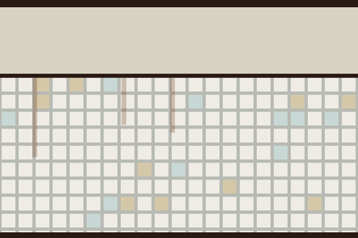

```text
WALL texture vegg_fliser: straight-on front view of a wall section exactly 1.5 times as wide as it is tall. The bottom edge is where the wall meets the floor and the top edge is the top of the wall: no floor, no ceiling, no sky. It must tile seamlessly from left to right only. No doors, windows, lamps, pictures, furniture or signs, and no black band at the top or bottom (the game adds the ink edge). Layout from the bottom: 0-68% small square glazed tiles, about 6 per metre, off-white (#eeece4), grout #b8bab4, a few pale green (#c8d8d4) and beige (#d4c8a8) tiles, two or three rust drips (#7a461e) from the top row; 68-70% a dark trim; 70-100% plaster (#d8d4c4) with a few stains. Landscape, 1536 x 1024.
The attached image shows how the game paints this surface today, over the same area. Use it only for the layout and the scale; paint it properly in the texture style.
```

## 11c. Murveggen (tekstur)

Filnavn: `vegg_mur.png`

Gir: `vegg_mur`

Brukes i: kjeller, fyrrom, gårdsrom, lysgård, søppelrom og det hemmelige rommet. Blir 442 x 294 punkter i spillet.

Referanse (last opp sammen med prompten): `tegnelister/referanse/ref_vegg_mur.png`

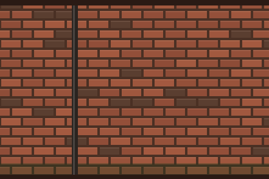

```text
WALL texture vegg_mur: straight-on front view of a wall section exactly 1.5 times as wide as it is tall. The bottom edge is where the wall meets the floor and the top edge is the top of the wall: no floor, no ceiling, no sky. It must tile seamlessly from left to right only. No doors, windows, lamps, pictures, furniture or signs, and no black band at the top or bottom (the game adds the ink edge). Red brick in running bond, about 8 courses per metre, bricks #8a4a36 to #a45a40 with a few darker (#5a3e30), mortar #4a3024, damp green-black along the bottom 10%, a few iron wall hooks. Landscape, 1536 x 1024.
The attached image shows how the game paints this surface today, over the same area. Use it only for the layout and the scale; paint it properly in the texture style.
```

## 11d. Hekken (tekstur)

Filnavn: `vegg_hekk.png`

Gir: `vegg_hekk`

Brukes i: gangene i Parken, hage, lysthus, fontene, isdam og sjefsrommet i Parken. Blir 326 x 218 punkter i spillet.

Referanse (last opp sammen med prompten): `tegnelister/referanse/ref_vegg_hekk.png`

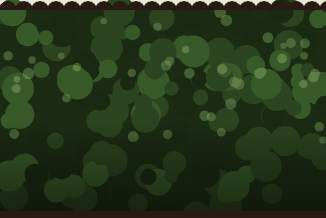

```text
WALL texture vegg_hekk: straight-on front view of a wall section exactly 1.5 times as wide as it is tall. The bottom edge is where the wall meets the floor and the top edge is the top of the wall: no floor, no ceiling, no sky. It must tile seamlessly from left to right only. No doors, windows, lamps, pictures, furniture or signs, and no black band at the top or bottom (the game adds the ink edge). A dense clipped hedge seen from the side: small leaves in #1c2c14, #2c4420 and #385a28, lighter leaf highlights in the upper half, darker toward the ground; the top edge is a soft row of rounded leaf bumps; no trunks, no flowers. Landscape, 1536 x 1024.
The attached image shows how the game paints this surface today, over the same area. Use it only for the layout and the scale; paint it properly in the texture style.
```

## 11e. Bakken i Parken (tekstur)

Filnavn: `bakke_park.png`

Gir: `bakke_park`

Brukes i: bakken utenfor rommene i Parken. Blir 512 x 512 punkter i spillet, 256 x 256 på telefon og TV.

Referanse (last opp sammen med prompten): `tegnelister/referanse/ref_bakke_park.png`

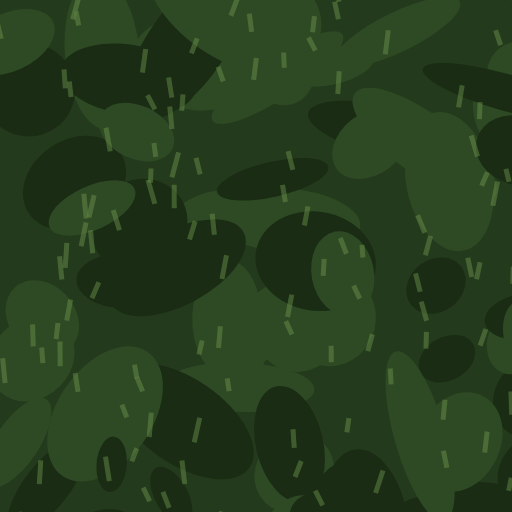

```text
GROUND texture bakke_park: seamless and tileable in both directions, seen straight from above. The square image covers 4 x 4 metres of open ground outside the building: no grid, no path, no objects. Clearly darker than the room floors. A dark night lawn (#243a1c) with irregular patches of #2e4a24 and #1a2c14, short grass strokes in muted green, a few fallen leaves. Square, 1024 x 1024.
The attached image shows how the game paints this surface today, over the same area. Use it only for the layout and the scale; paint it properly in the texture style.
```

## 11f. Panelveggen i Underetasjen (tekstur)

Filnavn: `vegg_panel_3.png`

Gir: `vegg_panel_3`

Brukes i: de samme veggene i Underetasjen. Blir 442 x 294 punkter i spillet.

Referanse (last opp sammen med prompten): `tegnelister/referanse/ref_vegg_panel_3.png`


```text
WALL texture vegg_panel_3: straight-on front view of a wall section exactly 1.5 times as wide as it is tall. The bottom edge is where the wall meets the floor and the top edge is the top of the wall: no floor, no ceiling, no sky. It must tile seamlessly from left to right only. No doors, windows, lamps, pictures, furniture or signs, and no black band at the top or bottom (the game adds the ink edge). Rails must sit where the game's 3D mouldings are: skirting 0-7 percent, dado rail 43-46 percent, cornice band 94-100 percent. Exactly the same layout as vegg_panel, only these colours: plaster #c4ddd3, wainscot #3f6e6a, skirting #1e3331 (a damp hydrotherapy basement). Landscape, 1536 x 1024.
The attached image shows how the game paints this surface today, over the same area. Use it only for the layout and the scale; paint it properly in the texture style.
```

## 11g. Panelveggen i Kjelleren (tekstur)

Filnavn: `vegg_panel_4.png`

Gir: `vegg_panel_4`

Brukes i: de samme veggene i Kjelleren. Blir 442 x 294 punkter i spillet.

Referanse (last opp sammen med prompten): `tegnelister/referanse/ref_vegg_panel_4.png`


```text
WALL texture vegg_panel_4: straight-on front view of a wall section exactly 1.5 times as wide as it is tall. The bottom edge is where the wall meets the floor and the top edge is the top of the wall: no floor, no ceiling, no sky. It must tile seamlessly from left to right only. No doors, windows, lamps, pictures, furniture or signs, and no black band at the top or bottom (the game adds the ink edge). Rails must sit where the game's 3D mouldings are: skirting 0-7 percent, dado rail 43-46 percent, cornice band 94-100 percent. Exactly the same layout as vegg_panel, only these colours: plaster #e6dcc2, wainscot #8a7a5a, skirting #2e2618 (a dusty archive cellar). Landscape, 1536 x 1024.
The attached image shows how the game paints this surface today, over the same area. Use it only for the layout and the scale; paint it properly in the texture style.
```

## 11h. Panelveggen i Dypet (tekstur)

Filnavn: `vegg_panel_6.png`

Gir: `vegg_panel_6`

Brukes i: de samme veggene i Dypet. Blir 442 x 294 punkter i spillet.

Referanse (last opp sammen med prompten): `tegnelister/referanse/ref_vegg_panel_6.png`


```text
WALL texture vegg_panel_6: straight-on front view of a wall section exactly 1.5 times as wide as it is tall. The bottom edge is where the wall meets the floor and the top edge is the top of the wall: no floor, no ceiling, no sky. It must tile seamlessly from left to right only. No doors, windows, lamps, pictures, furniture or signs, and no black band at the top or bottom (the game adds the ink edge). Rails must sit where the game's 3D mouldings are: skirting 0-7 percent, dado rail 43-46 percent, cornice band 94-100 percent. Exactly the same layout as vegg_panel, only these colours: plaster #57445f, wainscot #2c1d36, skirting #140c1a (dim, violet and a little wet). Landscape, 1536 x 1024.
The attached image shows how the game paints this surface today, over the same area. Use it only for the layout and the scale; paint it properly in the texture style.
```

## 11i. Tapetveggen (tekstur)

Filnavn: `vegg_tapet.png`

Gir: `vegg_tapet`

Brukes i: sovesal, dagligstue, direktørens kontor, bibliotek, eget rom og skattkammeret. Blir 442 x 294 punkter i spillet.

Referanse (last opp sammen med prompten): `tegnelister/referanse/ref_vegg_tapet.png`

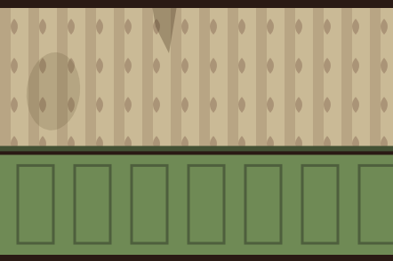

```text
WALL texture vegg_tapet: straight-on front view of a wall section exactly 1.5 times as wide as it is tall. The bottom edge is where the wall meets the floor and the top edge is the top of the wall: no floor, no ceiling, no sky. It must tile seamlessly from left to right only. No doors, windows, lamps, pictures, furniture or signs, and no black band at the top or bottom (the game adds the ink edge). Rails must sit where the game's 3D mouldings are: skirting 0-7 percent, dado rail 43-46 percent, cornice band 94-100 percent. Layout from the bottom: 0-43% dark wood wainscot (#6a5a40) with framed panels; 43-46% a wooden rail; 46-100% faded damask wallpaper (#bca27c) with a darker pattern (#5a3228) in vertical strips, one peeling seam, one water stain. Landscape, 1536 x 1024.
The attached image shows how the game paints this surface today, over the same area. Use it only for the layout and the scale; paint it properly in the texture style.
```

## 11j. Steinveggen (tekstur)

Filnavn: `vegg_stein.png`

Gir: `vegg_stein`

Brukes i: kapell, likkapell, begravelse, det forbannede rommet og blodofferet. Blir 442 x 294 punkter i spillet.

Referanse (last opp sammen med prompten): `tegnelister/referanse/ref_vegg_stein.png`

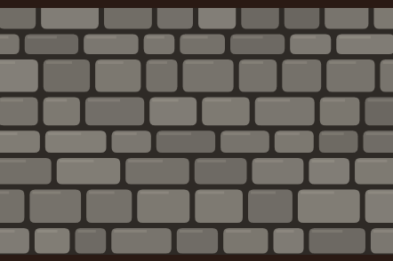

```text
WALL texture vegg_stein: straight-on front view of a wall section exactly 1.5 times as wide as it is tall. The bottom edge is where the wall meets the floor and the top edge is the top of the wall: no floor, no ceiling, no sky. It must tile seamlessly from left to right only. No doors, windows, lamps, pictures, furniture or signs, and no black band at the top or bottom (the game adds the ink edge). Grey dressed stone blocks of uneven length, 3 to 4 courses per metre, #6a6660 to #848078, dark joints #2e2a26, chipped corners, old soot. Landscape, 1536 x 1024.
The attached image shows how the game paints this surface today, over the same area. Use it only for the layout and the scale; paint it properly in the texture style.
```

## 11k. Den polstrede veggen (tekstur)

Filnavn: `vegg_polstret.png`

Gir: `vegg_polstret`

Brukes i: isolatet. Blir 442 x 294 punkter i spillet.

Referanse (last opp sammen med prompten): `tegnelister/referanse/ref_vegg_polstret.png`


```text
WALL texture vegg_polstret: straight-on front view of a wall section exactly 1.5 times as wide as it is tall. The bottom edge is where the wall meets the floor and the top edge is the top of the wall: no floor, no ceiling, no sky. It must tile seamlessly from left to right only. No doors, windows, lamps, pictures, furniture or signs, and no black band at the top or bottom (the game adds the ink edge). Quilted padded canvas (#e2d8be), diagonal tufting forming diamonds about 25 cm wide, a cloth button at every crossing, a few brown stains, one torn seam with stuffing. Landscape, 1536 x 1024.
The attached image shows how the game paints this surface today, over the same area. Use it only for the layout and the scale; paint it properly in the texture style.
```

## 11l. Treveggen (tekstur)

Filnavn: `vegg_tre.png`

Gir: `vegg_tre`

Brukes i: vaktmesteren og vaktboden. Blir 442 x 294 punkter i spillet.

Referanse (last opp sammen med prompten): `tegnelister/referanse/ref_vegg_tre.png`


```text
WALL texture vegg_tre: straight-on front view of a wall section exactly 1.5 times as wide as it is tall. The bottom edge is where the wall meets the floor and the top edge is the top of the wall: no floor, no ceiling, no sky. It must tile seamlessly from left to right only. No doors, windows, lamps, pictures, furniture or signs, and no black band at the top or bottom (the game adds the ink edge). Vertical board-and-batten, boards about 17 cm wide, #6a4a2c to #86603a, dark gaps, a few knots and nail heads. Landscape, 1536 x 1024.
The attached image shows how the game paints this surface today, over the same area. Use it only for the layout and the scale; paint it properly in the texture style.
```

## 11m. Paviljongveggen (tekstur)

Filnavn: `vegg_paviljong.png`

Gir: `vegg_paviljong`

Brukes i: paviljongene i Parken. Blir 442 x 294 punkter i spillet.

Referanse (last opp sammen med prompten): `tegnelister/referanse/ref_vegg_paviljong.png`


```text
WALL texture vegg_paviljong: straight-on front view of a wall section exactly 1.5 times as wide as it is tall. The bottom edge is where the wall meets the floor and the top edge is the top of the wall: no floor, no ceiling, no sky. It must tile seamlessly from left to right only. No doors, windows, lamps, pictures, furniture or signs, and no black band at the top or bottom (the game adds the ink edge). Rails must sit where the game's 3D mouldings are: skirting 0-7 percent, dado rail 43-46 percent, cornice band 94-100 percent. Layout from the bottom: 0-10% a green-painted base (#5e7a4a) with a dark top edge; 10-100% white horizontal clapboard (#d8d0b8), boards about 14 cm high with a thin shadow under each; no corner posts. Landscape, 1536 x 1024.
The attached image shows how the game paints this surface today, over the same area. Use it only for the layout and the scale; paint it properly in the texture style.
```

## 11n. Tømmerveggen (tekstur)

Filnavn: `vegg_tommer.png`

Gir: `vegg_tommer`

Brukes i: koiene i Nattskogen. Blir 442 x 294 punkter i spillet.

Referanse (last opp sammen med prompten): `tegnelister/referanse/ref_vegg_tommer.png`


```text
WALL texture vegg_tommer: straight-on front view of a wall section exactly 1.5 times as wide as it is tall. The bottom edge is where the wall meets the floor and the top edge is the top of the wall: no floor, no ceiling, no sky. It must tile seamlessly from left to right only. No doors, windows, lamps, pictures, furniture or signs, and no black band at the top or bottom (the game adds the ink edge). Round horizontal logs, about 4 per metre, lit on top (#8a6440) and dark underneath (#3e2814), pale chinking (#c8b48a) between them, cracks and knots, no log ends. Landscape, 1536 x 1024.
The attached image shows how the game paints this surface today, over the same area. Use it only for the layout and the scale; paint it properly in the texture style.
```

## 11o. Skogkanten (tekstur)

Filnavn: `vegg_skog.png`

Gir: `vegg_skog`

Brukes i: gangene og rommene i Nattskogen. Blir 538 x 358 punkter i spillet.

Referanse (last opp sammen med prompten): `tegnelister/referanse/ref_vegg_skog.png`

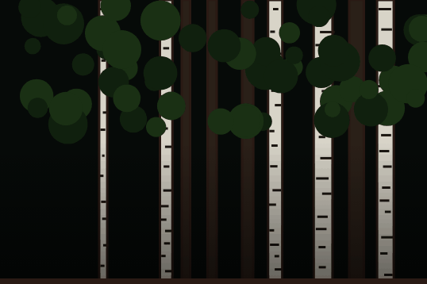

```text
WALL texture vegg_skog: straight-on front view of a wall section exactly 1.5 times as wide as it is tall. The bottom edge is where the wall meets the floor and the top edge is the top of the wall: no floor, no ceiling, no sky. It must tile seamlessly from left to right only. No doors, windows, lamps, pictures, furniture or signs, and no black band at the top or bottom (the game adds the ink edge). The edge of a dark night forest from the side: birch trunks (#d8d4c8 with black marks) and spruce trunks (#2a2018) of varied widths, dense needles (#10200e, #1a3014) in the upper half, almost black toward the ground; the top edge is canopy, no sky. Landscape, 1536 x 1024.
The attached image shows how the game paints this surface today, over the same area. Use it only for the layout and the scale; paint it properly in the texture style.
```

## 11p. Steinmuren (tekstur)

Filnavn: `vegg_steinmur.png`

Gir: `vegg_steinmur`

Brukes i: kirkegården og gårdsplassen. Blir 230 x 154 punkter i spillet.

Referanse (last opp sammen med prompten): `tegnelister/referanse/ref_vegg_steinmur.png`

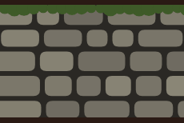

```text
WALL texture vegg_steinmur: straight-on front view of a wall section exactly 1.5 times as wide as it is tall. The bottom edge is where the wall meets the floor and the top edge is the top of the wall: no floor, no ceiling, no sky. It must tile seamlessly from left to right only. No doors, windows, lamps, pictures, furniture or signs, and no black band at the top or bottom (the game adds the ink edge). A low dry-stone wall of rounded field stones (#6e6a60 to #8a8676) in dark joints, green moss (#3e5a28) along the top. Landscape, 1536 x 1024.
The attached image shows how the game paints this surface today, over the same area. Use it only for the layout and the scale; paint it properly in the texture style.
```

## 11q. Smijernsgjerdet (tekstur)

Filnavn: `vegg_gjerde.png`

Gir: `vegg_gjerde`

Brukes i: liggehallen. Blir 307 x 205 punkter i spillet.

Referanse (last opp sammen med prompten): `tegnelister/referanse/ref_vegg_gjerde.png`


```text
WALL texture vegg_gjerde: straight-on front view of a wall section exactly 1.5 times as wide as it is tall. The bottom edge is where the wall meets the floor and the top edge is the top of the wall: no floor, no ceiling, no sky. It must tile seamlessly from left to right only. No doors, windows, lamps, pictures, furniture or signs. A wrought-iron fence (#16161a) with spear-tipped bars, about 6 per metre, and two horizontal rails, on a grey stone base (#6a665e) along the bottom 22%. EXCEPTION to the style block: TRANSPARENT between and above the bars. Landscape, 1536 x 1024.
The attached image shows how the game paints this surface today, over the same area. Use it only for the layout and the scale; paint it properly in the texture style.
```

## 11r. Ruinmuren (tekstur)

Filnavn: `vegg_ruin.png`

Gir: `vegg_ruin`

Brukes i: ruinen i Nattskogen. Blir 211 x 141 punkter i spillet.

Referanse (last opp sammen med prompten): `tegnelister/referanse/ref_vegg_ruin.png`

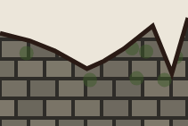

```text
WALL texture vegg_ruin: straight-on front view of a wall section exactly 1.5 times as wide as it is tall. The bottom edge is where the wall meets the floor and the top edge is the top of the wall: no floor, no ceiling, no sky. It must tile seamlessly from left to right only. No doors, windows, lamps, pictures, furniture or signs. A crumbling stone wall with a jagged broken top edge, stones #6a665c to #807a6c in dark joints, moss patches. EXCEPTION to the style block: TRANSPARENT above the broken edge. Landscape, 1536 x 1024.
The attached image shows how the game paints this surface today, over the same area. Use it only for the layout and the scale; paint it properly in the texture style.
```

## 11s. De røde forhengene (tekstur)

Filnavn: `vegg_forheng.png`

Gir: `vegg_forheng`

Brukes i: drømmen i kapittel 5. Blir 442 x 294 punkter i spillet.

Referanse (last opp sammen med prompten): `tegnelister/referanse/ref_vegg_forheng.png`


```text
WALL texture vegg_forheng: straight-on front view of a wall section exactly 1.5 times as wide as it is tall. The bottom edge is where the wall meets the floor and the top edge is the top of the wall: no floor, no ceiling, no sky. It must tile seamlessly from left to right only. No doors, windows, lamps, pictures, furniture or signs, and no black band at the top or bottom (the game adds the ink edge). Heavy deep-red velvet curtains (#5a0a0e) in vertical folds with lit ridges (#c82c34), floor length, dreamlike and a little wrong; the fold rhythm continues across the left and right edges. Landscape, 1536 x 1024.
The attached image shows how the game paints this surface today, over the same area. Use it only for the layout and the scale; paint it properly in the texture style.
```

## 11t. Bakken i Nattskogen (tekstur)

Filnavn: `bakke_skog.png`

Gir: `bakke_skog`

Brukes i: bakken utenfor rommene i Nattskogen. Blir 512 x 512 punkter i spillet, 256 x 256 på telefon og TV.

Referanse (last opp sammen med prompten): `tegnelister/referanse/ref_bakke_skog.png`

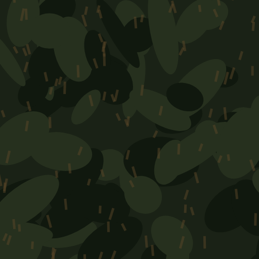

```text
GROUND texture bakke_skog: seamless and tileable in both directions, seen straight from above. The square image covers 4 x 4 metres of open ground outside the building: no grid, no path, no objects. Clearly darker than the room floors. A dark forest floor at night (#1a2216) with fallen needles (#5a4628), moss (#26301e), small roots and twigs. Square, 1024 x 1024.
The attached image shows how the game paints this surface today, over the same area. Use it only for the layout and the scale; paint it properly in the texture style.
```
