# Tegneliste 12: Gulvene

Laget av `tools/lag_tegnelister.py`. Ikke rediger for hånd; kjør skriptet på nytt når bilder er levert, så forsvinner det som er ferdig.

Gulvene. Bestill dem først når Claude sier at gulvet tegnes med egne fliser i spillet, ellers presses bildene ned til 24 til 32 punkter per rute. Start samtalen med stilblokken for teksturer under, og last opp to godkjente vegger fra liste 11 som stilreferanse. Plankegulvet og sjakkgulvet først; de dekker mest.

## Slik gjør du det

1. Start en ny samtale i ChatGPT og lim inn stilblokken for teksturer under (ikke den vanlige). Bruk samme samtale for hele lista, så stilen holder seg.
2. For hvert bilde: last opp referansebildet som står ved det, og lim inn prompten. Det trengs ingen mal.
3. Last ned resultatet som PNG og gi det nøyaktig filnavnet som står ved bildet.
4. Last fila opp til `gpt-grafikk/` i repoet (Add file, Upload files) og commit til `main`. Resten går av seg selv: bildet skaleres, kantene rettes hvis de ikke går helt i ett, og det lagres som WebP.

## Stilblokk for teksturer (lim inn først)

```text
Style: hand-painted cartoon game TEXTURES in the style of Conan Chop Chop mixed with Castle Crashers, for a 1923 Norwegian sanatorium (Lovecraftian, a bit gross, darkly funny). Dark brown ink lines (#2a1a14), slightly wobbly and hand-inked but thinner and calmer than on the characters, so figures stay readable on top. Flat muted warm colours with one darker cel-shade tone; every tile, board, brick or stone has a thin light edge on the upper left and a darker edge on the lower right. Mid values only: no large pure-black or pure-white areas. Even, flat lighting over the whole image: no vignette, no light pools, no cast shadows, no perspective, no blur, no photo texture. Fully OPAQUE image (transparency only where the prompt says so). No text, no signature, no frame, no objects lying on the surface. Keep the same style, line weight and scale for every texture in this conversation.
```

## 12a. Plankegulvet (tekstur)

Filnavn: `gulv_planker.png`

Gir: `gulv_planker`

Brukes i: korridorene i Mottaket. Blir 512 x 512 punkter i spillet.

Referanse (last opp sammen med prompten): `tegnelister/referanse/ref_gulv_planker.png`

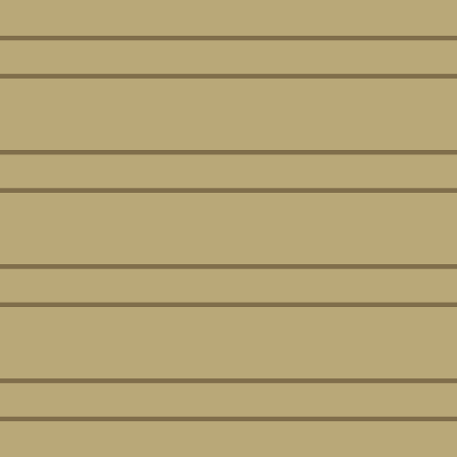

```text
FLOOR texture gulv_planker: seamless and tileable in both directions, seen straight from above (orthographic, 90 degrees). The square image shows exactly 4 x 4 floor squares of 1 x 1 metre; tile or board grid lines fall exactly at 0, 25, 50 and 75 percent of the width and height. The left edge continues into the right edge and the top edge into the bottom edge. Boards run left to right. No rugs, blood, puddles or wall shadows (the game adds them). Floorboards, 3 per metre, staggered end joints, small nail heads, a slightly worn lane along the middle; boards #b9a878, seams #3c2814. Square, 1024 x 1024.
The attached image shows how the game paints this surface today, over the same area. Use it only for the layout and the scale; paint it properly in the texture style.
```

## 12b. Sjakkgulvet (tekstur)

Filnavn: `gulv_sjakk.png`

Gir: `gulv_sjakk`

Brukes i: venterom, tannlege, frisør, kafeteria og sjefsrommene i Mottaket, og paviljongene i Parken. Blir 512 x 512 punkter i spillet.

Referanse (last opp sammen med prompten): `tegnelister/referanse/ref_gulv_sjakk.png`

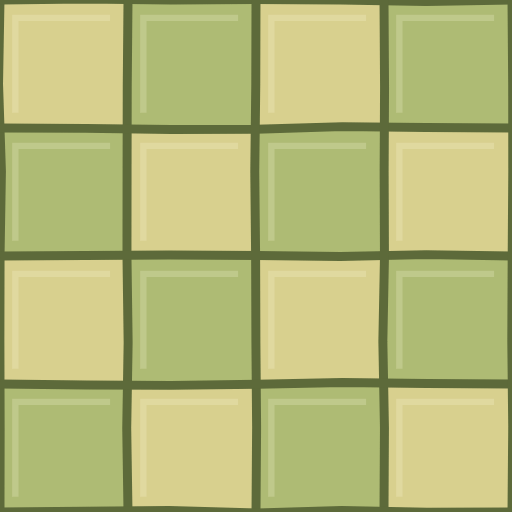

```text
FLOOR texture gulv_sjakk: seamless and tileable in both directions, seen straight from above (orthographic, 90 degrees). The square image shows exactly 4 x 4 floor squares of 1 x 1 metre; tile or board grid lines fall exactly at 0, 25, 50 and 75 percent of the width and height. The left edge continues into the right edge and the top edge into the bottom edge. No rugs, blood, puddles or wall shadows (the game adds them). One glazed tile per square metre in a checkerboard, light #d8d08e and dark #aebb74, the top-left square light; grout #5d6a3a as slightly wobbly ink lines; a few chipped corners. Square, 1024 x 1024.
The attached image shows how the game paints this surface today, over the same area. Use it only for the layout and the scale; paint it properly in the texture style.
```

## 12c. Sjakkgulvet i Underetasjen (tekstur)

Filnavn: `gulv_sjakk_3.png`

Gir: `gulv_sjakk_3`

Brukes i: de samme rommene i Underetasjen. Blir 512 x 512 punkter i spillet.

Referanse (last opp sammen med prompten): `tegnelister/referanse/ref_gulv_sjakk_3.png`

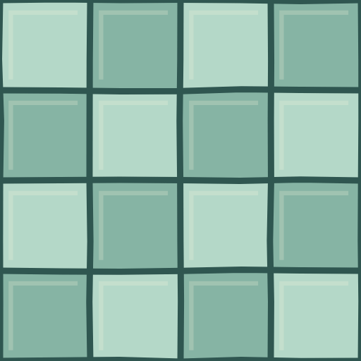

```text
FLOOR texture gulv_sjakk_3: seamless and tileable in both directions, seen straight from above (orthographic, 90 degrees). The square image shows exactly 4 x 4 floor squares of 1 x 1 metre; tile or board grid lines fall exactly at 0, 25, 50 and 75 percent of the width and height. The left edge continues into the right edge and the top edge into the bottom edge. No rugs, blood, puddles or wall shadows (the game adds them). Exactly the same as gulv_sjakk, only these colours: light #b4d8c8, dark #86b4a4, grout #2f5650. Square, 1024 x 1024.
The attached image shows how the game paints this surface today, over the same area. Use it only for the layout and the scale; paint it properly in the texture style.
```

## 12d. Sjakkgulvet i Kjelleren (tekstur)

Filnavn: `gulv_sjakk_4.png`

Gir: `gulv_sjakk_4`

Brukes i: de samme rommene i Kjelleren. Blir 512 x 512 punkter i spillet.

Referanse (last opp sammen med prompten): `tegnelister/referanse/ref_gulv_sjakk_4.png`

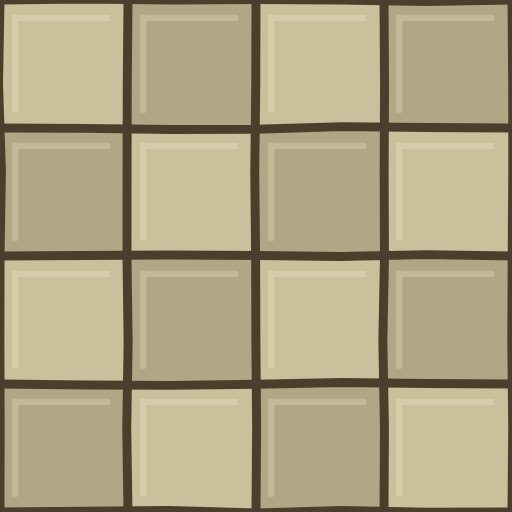

```text
FLOOR texture gulv_sjakk_4: seamless and tileable in both directions, seen straight from above (orthographic, 90 degrees). The square image shows exactly 4 x 4 floor squares of 1 x 1 metre; tile or board grid lines fall exactly at 0, 25, 50 and 75 percent of the width and height. The left edge continues into the right edge and the top edge into the bottom edge. No rugs, blood, puddles or wall shadows (the game adds them). Exactly the same as gulv_sjakk, only these colours: light #cbbf9c, dark #b3a684, grout #4a3f2c. Square, 1024 x 1024.
The attached image shows how the game paints this surface today, over the same area. Use it only for the layout and the scale; paint it properly in the texture style.
```

## 12e. Sjakkgulvet i Dypet (tekstur)

Filnavn: `gulv_sjakk_6.png`

Gir: `gulv_sjakk_6`

Brukes i: de samme rommene i Dypet. Blir 512 x 512 punkter i spillet.

Referanse (last opp sammen med prompten): `tegnelister/referanse/ref_gulv_sjakk_6.png`

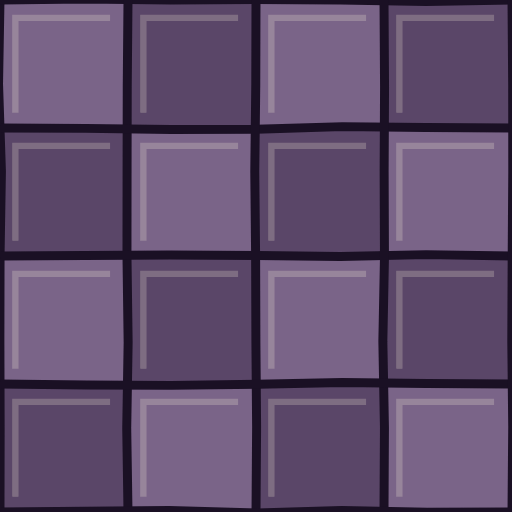

```text
FLOOR texture gulv_sjakk_6: seamless and tileable in both directions, seen straight from above (orthographic, 90 degrees). The square image shows exactly 4 x 4 floor squares of 1 x 1 metre; tile or board grid lines fall exactly at 0, 25, 50 and 75 percent of the width and height. The left edge continues into the right edge and the top edge into the bottom edge. No rugs, blood, puddles or wall shadows (the game adds them). Exactly the same as gulv_sjakk, only these colours: light #7a6488, dark #5a4668, grout #1a1024. Square, 1024 x 1024.
The attached image shows how the game paints this surface today, over the same area. Use it only for the layout and the scale; paint it properly in the texture style.
```

## 12f. Plankegulvet i Underetasjen (tekstur)

Filnavn: `gulv_planker_3.png`

Gir: `gulv_planker_3`

Brukes i: korridorene i Underetasjen. Blir 512 x 512 punkter i spillet.

Referanse (last opp sammen med prompten): `tegnelister/referanse/ref_gulv_planker_3.png`

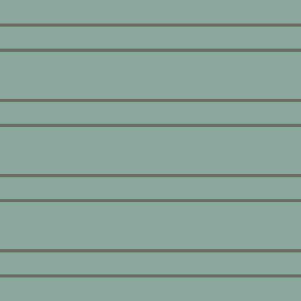

```text
FLOOR texture gulv_planker_3: seamless and tileable in both directions, seen straight from above (orthographic, 90 degrees). The square image shows exactly 4 x 4 floor squares of 1 x 1 metre; tile or board grid lines fall exactly at 0, 25, 50 and 75 percent of the width and height. The left edge continues into the right edge and the top edge into the bottom edge. Boards run left to right. No rugs, blood, puddles or wall shadows (the game adds them). Exactly the same as gulv_planker, only these colours: damp grey-green painted boards (#8aa89c), seams #1e3331. Square, 1024 x 1024.
The attached image shows how the game paints this surface today, over the same area. Use it only for the layout and the scale; paint it properly in the texture style.
```

## 12g. Plankegulvet i Kjelleren (tekstur)

Filnavn: `gulv_planker_4.png`

Gir: `gulv_planker_4`

Brukes i: korridorene i Kjelleren. Blir 512 x 512 punkter i spillet.

Referanse (last opp sammen med prompten): `tegnelister/referanse/ref_gulv_planker_4.png`

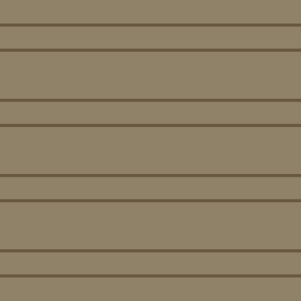

```text
FLOOR texture gulv_planker_4: seamless and tileable in both directions, seen straight from above (orthographic, 90 degrees). The square image shows exactly 4 x 4 floor squares of 1 x 1 metre; tile or board grid lines fall exactly at 0, 25, 50 and 75 percent of the width and height. The left edge continues into the right edge and the top edge into the bottom edge. Boards run left to right. No rugs, blood, puddles or wall shadows (the game adds them). Exactly the same as gulv_planker, only these colours: dusty boards (#8f8268) with coal dust in the seams (#2e2618). Square, 1024 x 1024.
The attached image shows how the game paints this surface today, over the same area. Use it only for the layout and the scale; paint it properly in the texture style.
```

## 12h. Plankegulvet i Dypet (tekstur)

Filnavn: `gulv_planker_6.png`

Gir: `gulv_planker_6`

Brukes i: korridorene i Dypet. Blir 512 x 512 punkter i spillet.

Referanse (last opp sammen med prompten): `tegnelister/referanse/ref_gulv_planker_6.png`

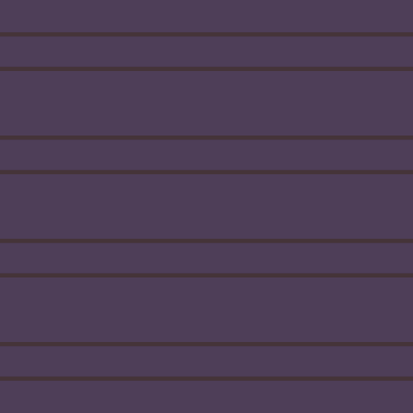

```text
FLOOR texture gulv_planker_6: seamless and tileable in both directions, seen straight from above (orthographic, 90 degrees). The square image shows exactly 4 x 4 floor squares of 1 x 1 metre; tile or board grid lines fall exactly at 0, 25, 50 and 75 percent of the width and height. The left edge continues into the right edge and the top edge into the bottom edge. Boards run left to right. No rugs, blood, puddles or wall shadows (the game adds them). Exactly the same as gulv_planker, only these colours: wet purple-black boards (#4e3e58) with a faint sheen, seams #140c1a. Square, 1024 x 1024.
The attached image shows how the game paints this surface today, over the same area. Use it only for the layout and the scale; paint it properly in the texture style.
```

## 12i. Tregulvet (tekstur)

Filnavn: `gulv_tre.png`

Gir: `gulv_tre`

Brukes i: sovesal, spisesal, bibliotek, eget rom, vaktbod, liggehallen og koiene. Blir 512 x 512 punkter i spillet.

Referanse (last opp sammen med prompten): `tegnelister/referanse/ref_gulv_tre.png`

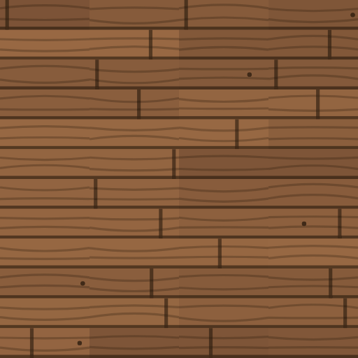

```text
FLOOR texture gulv_tre: seamless and tileable in both directions, seen straight from above (orthographic, 90 degrees). The square image shows exactly 4 x 4 floor squares of 1 x 1 metre; tile or board grid lines fall exactly at 0, 25, 50 and 75 percent of the width and height. The left edge continues into the right edge and the top edge into the bottom edge. Boards run left to right. No rugs, blood, puddles or wall shadows (the game adds them). Dark oak boards, 3 per metre, #7a5236 to #9a6a44, staggered joints, a few knots. Square, 1024 x 1024.
The attached image shows how the game paints this surface today, over the same area. Use it only for the layout and the scale; paint it properly in the texture style.
```

## 12j. Parketten (tekstur)

Filnavn: `gulv_parkett.png`

Gir: `gulv_parkett`

Brukes i: arkiv, kartotek, direktørens kontor, journalrom og skattkammeret. Blir 512 x 512 punkter i spillet.

Referanse (last opp sammen med prompten): `tegnelister/referanse/ref_gulv_parkett.png`

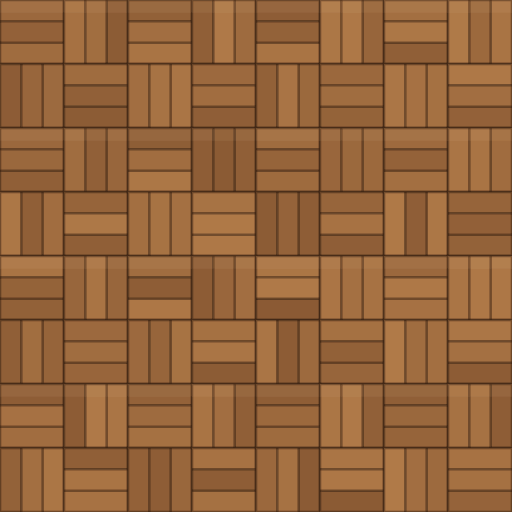

```text
FLOOR texture gulv_parkett: seamless and tileable in both directions, seen straight from above (orthographic, 90 degrees). The square image shows exactly 4 x 4 floor squares of 1 x 1 metre; tile or board grid lines fall exactly at 0, 25, 50 and 75 percent of the width and height. The left edge continues into the right edge and the top edge into the bottom edge. No rugs, blood, puddles or wall shadows (the game adds them). Basket-weave parquet: each square metre is 2 x 2 blocks of 3 slats, alternating horizontal and vertical, #8a5a34 to #b07a48, seams #28160a. Square, 1024 x 1024.
The attached image shows how the game paints this surface today, over the same area. Use it only for the layout and the scale; paint it properly in the texture style.
```

## 12k. Linoleumen (tekstur)

Filnavn: `gulv_linoleum.png`

Gir: `gulv_linoleum`

Brukes i: behandling, isolat, elektro, røntgen og medisin. Blir 512 x 512 punkter i spillet.

Referanse (last opp sammen med prompten): `tegnelister/referanse/ref_gulv_linoleum.png`

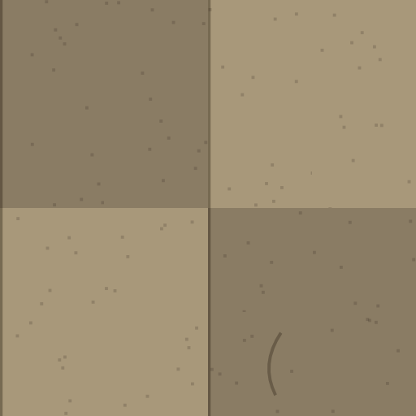

```text
FLOOR texture gulv_linoleum: seamless and tileable in both directions, seen straight from above (orthographic, 90 degrees). The square image covers exactly 4 x 4 metres of floor. The left edge continues into the right edge and the top edge into the bottom edge. No rugs, blood, puddles or wall shadows (the game adds them). A big checker of 2 x 2 metre squares (2 x 2 in the image) in #a8987a and #8a7c64, fine dark specks, a few scuffs, one curved scratch. Square, 1024 x 1024.
The attached image shows how the game paints this surface today, over the same area. Use it only for the layout and the scale; paint it properly in the texture style.
```

## 12l. Småflisene (tekstur)

Filnavn: `gulv_fliser.png`

Gir: `gulv_fliser`

Brukes i: kjøkken, vaskeri og operasjon. Blir 512 x 512 punkter i spillet.

Referanse (last opp sammen med prompten): `tegnelister/referanse/ref_gulv_fliser.png`

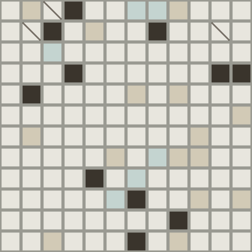

```text
FLOOR texture gulv_fliser: seamless and tileable in both directions, seen straight from above (orthographic, 90 degrees). The square image shows exactly 4 x 4 floor squares of 1 x 1 metre; tile or board grid lines fall exactly at 0, 25, 50 and 75 percent of the width and height. The left edge continues into the right edge and the top edge into the bottom edge. No rugs, blood, puddles or wall shadows (the game adds them). Small white tiles, 3 x 3 per square metre (12 x 12 in the image), #e8e6de, grout #9a9a92, a few #d2cab6 and #c4d4d0 tiles, two or three cracked dark ones (#3a342c). Square, 1024 x 1024.
The attached image shows how the game paints this surface today, over the same area. Use it only for the layout and the scale; paint it properly in the texture style.
```

## 12m. Sekskantmosaikken (tekstur)

Filnavn: `gulv_sekskant.png`

Gir: `gulv_sekskant`

Brukes i: bad og toalett. Blir 512 x 512 punkter i spillet.

Referanse (last opp sammen med prompten): `tegnelister/referanse/ref_gulv_sekskant.png`

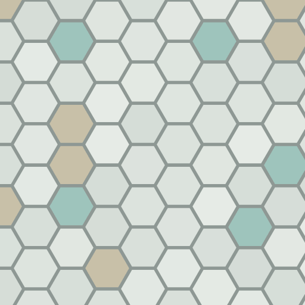

```text
FLOOR texture gulv_sekskant: seamless and tileable in both directions, seen straight from above (orthographic, 90 degrees). The square image covers exactly 4 x 4 metres of floor. The left edge continues into the right edge and the top edge into the bottom edge. No rugs, blood, puddles or wall shadows (the game adds them). White hexagon mosaic, about 3 per metre, #e6ebe6 and #d4dcd6, grout #8e9894, scattered mint tiles (#9ec4bc). Square, 1024 x 1024.
The attached image shows how the game paints this surface today, over the same area. Use it only for the layout and the scale; paint it properly in the texture style.
```

## 12n. Steinhellene (tekstur)

Filnavn: `gulv_stein.png`

Gir: `gulv_stein`

Brukes i: kjeller, fyrrom, lysgård, det hemmelige rommet, det forbannede rommet, blodofferet og ruinen. Blir 512 x 512 punkter i spillet.

Referanse (last opp sammen med prompten): `tegnelister/referanse/ref_gulv_stein.png`

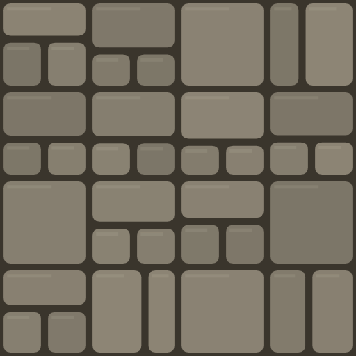

```text
FLOOR texture gulv_stein: seamless and tileable in both directions, seen straight from above (orthographic, 90 degrees). The square image covers exactly 4 x 4 metres of floor. The left edge continues into the right edge and the top edge into the bottom edge. No rugs, blood, puddles or wall shadows (the game adds them). Irregular flagstones, one to three per square metre, #7a7466 to #8e8676, dark joints #3a352c, a little moss in some joints. Square, 1024 x 1024.
The attached image shows how the game paints this surface today, over the same area. Use it only for the layout and the scale; paint it properly in the texture style.
```

## 12o. Betongen (tekstur)

Filnavn: `gulv_betong.png`

Gir: `gulv_betong`

Brukes i: likkapell, likhus, vaktmester, søppelrom og vaskerom. Blir 512 x 512 punkter i spillet.

Referanse (last opp sammen med prompten): `tegnelister/referanse/ref_gulv_betong.png`

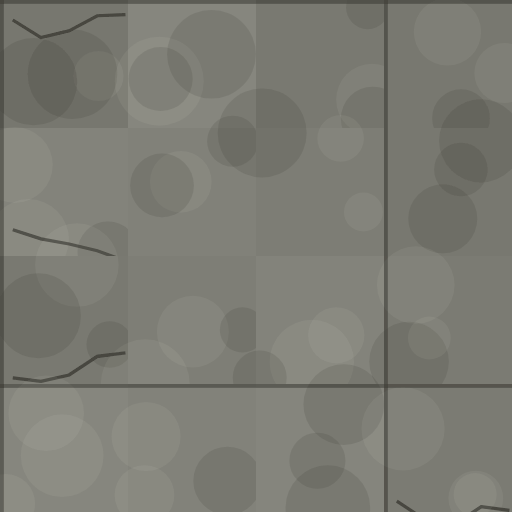

```text
FLOOR texture gulv_betong: seamless and tileable in both directions, seen straight from above (orthographic, 90 degrees). The square image covers exactly 4 x 4 metres of floor. The left edge continues into the right edge and the top edge into the bottom edge. No rugs, blood, puddles or wall shadows (the game adds them). Poured concrete, #86867e and #76766e in soft patches, joint lines every 2 metres (at 0 and 50 percent), old stains, two hairline cracks. Square, 1024 x 1024.
The attached image shows how the game paints this surface today, over the same area. Use it only for the layout and the scale; paint it properly in the texture style.
```

## 12p. Brosteinen (tekstur)

Filnavn: `gulv_brostein.png`

Gir: `gulv_brostein`

Brukes i: gårdsrommet. Blir 512 x 512 punkter i spillet.

Referanse (last opp sammen med prompten): `tegnelister/referanse/ref_gulv_brostein.png`

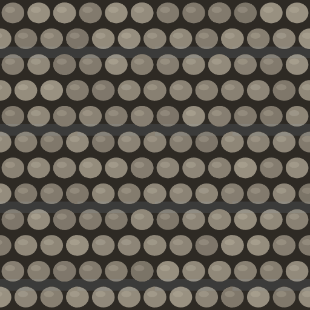

```text
FLOOR texture gulv_brostein: seamless and tileable in both directions, seen straight from above (orthographic, 90 degrees). The square image shows exactly 4 x 4 floor squares of 1 x 1 metre; tile or board grid lines fall exactly at 0, 25, 50 and 75 percent of the width and height. The left edge continues into the right edge and the top edge into the bottom edge. No rugs, blood, puddles or wall shadows (the game adds them). Rounded cobbles in 3 rows per metre, each row shifted by half a stone, #7a7266 to #9a9282, dark joints #2e2a24, a light top on each stone. Square, 1024 x 1024.
The attached image shows how the game paints this surface today, over the same area. Use it only for the layout and the scale; paint it properly in the texture style.
```

## 12q. Gresset (tekstur)

Filnavn: `gulv_gress.png`

Gir: `gulv_gress`

Brukes i: hage, lysthus, kirkegård, lysning og sjefsrommet i Nattskogen. Blir 512 x 512 punkter i spillet.

Referanse (last opp sammen med prompten): `tegnelister/referanse/ref_gulv_gress.png`

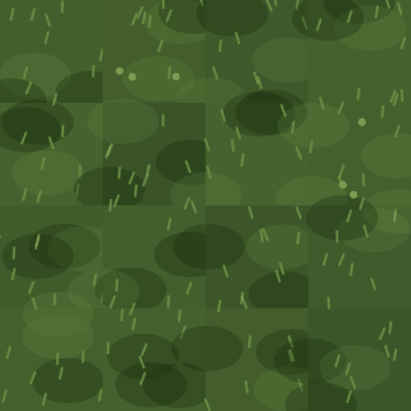

```text
FLOOR texture gulv_gress: seamless and tileable in both directions, seen straight from above (orthographic, 90 degrees). The square image covers exactly 4 x 4 metres of floor. The left edge continues into the right edge and the top edge into the bottom edge. No rugs, blood, puddles or wall shadows (the game adds them). Short night lawn, #3a5428 and #46622e, lighter blades #8cb45a, a few daisies, no path. Square, 1024 x 1024.
The attached image shows how the game paints this surface today, over the same area. Use it only for the layout and the scale; paint it properly in the texture style.
```

## 12r. Grusen (tekstur)

Filnavn: `gulv_grus.png`

Gir: `gulv_grus`

Brukes i: fontene, gårdsplass, gangene i Parken og sjefsrommet i Parken. Blir 512 x 512 punkter i spillet.

Referanse (last opp sammen med prompten): `tegnelister/referanse/ref_gulv_grus.png`

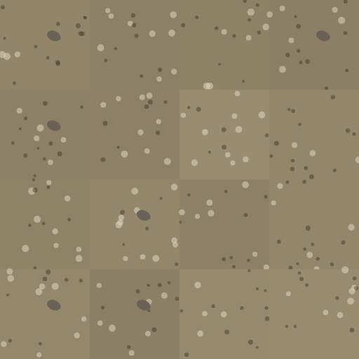

```text
FLOOR texture gulv_grus: seamless and tileable in both directions, seen straight from above (orthographic, 90 degrees). The square image covers exactly 4 x 4 metres of floor. The left edge continues into the right edge and the top edge into the bottom edge. No rugs, blood, puddles or wall shadows (the game adds them). Raked gravel #9a8c70 and #8a7e64 with dark and light pebbles and a few larger stones (#6a6254). Square, 1024 x 1024.
The attached image shows how the game paints this surface today, over the same area. Use it only for the layout and the scale; paint it properly in the texture style.
```

## 12s. Jorda (tekstur)

Filnavn: `gulv_jord.png`

Gir: `gulv_jord`

Brukes i: drivhuset. Blir 512 x 512 punkter i spillet.

Referanse (last opp sammen med prompten): `tegnelister/referanse/ref_gulv_jord.png`

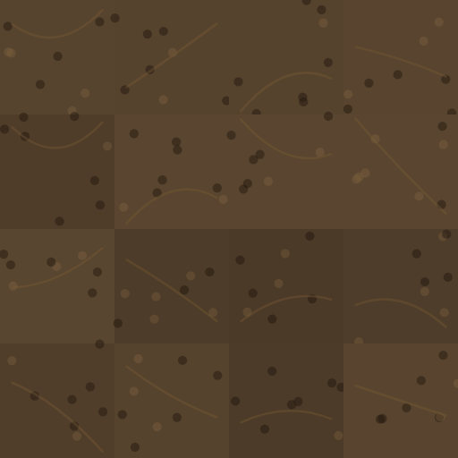

```text
FLOOR texture gulv_jord: seamless and tileable in both directions, seen straight from above (orthographic, 90 degrees). The square image covers exactly 4 x 4 metres of floor. The left edge continues into the right edge and the top edge into the bottom edge. No rugs, blood, puddles or wall shadows (the game adds them). Tilled soil #4a3a28 and #5a4630 in soft furrows running left to right, small clods. Square, 1024 x 1024.
The attached image shows how the game paints this surface today, over the same area. Use it only for the layout and the scale; paint it properly in the texture style.
```

## 12t. Mosen (tekstur)

Filnavn: `gulv_mose.png`

Gir: `gulv_mose`

Brukes i: bjørkeskogen og tjernet. Blir 512 x 512 punkter i spillet.

Referanse (last opp sammen med prompten): `tegnelister/referanse/ref_gulv_mose.png`

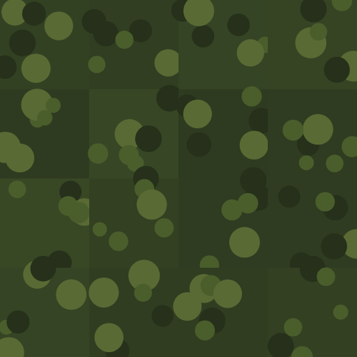

```text
FLOOR texture gulv_mose: seamless and tileable in both directions, seen straight from above (orthographic, 90 degrees). The square image covers exactly 4 x 4 metres of floor. The left edge continues into the right edge and the top edge into the bottom edge. No rugs, blood, puddles or wall shadows (the game adds them). Moss #2e3a20 and #3a4a26 with clumps of #4a5e2c, #26301a and #5a6a34, a few twigs. Square, 1024 x 1024.
The attached image shows how the game paints this surface today, over the same area. Use it only for the layout and the scale; paint it properly in the texture style.
```

## 12u. Stien (tekstur)

Filnavn: `gulv_sti.png`

Gir: `gulv_sti`

Brukes i: gangene i Nattskogen. Blir 512 x 512 punkter i spillet.

Referanse (last opp sammen med prompten): `tegnelister/referanse/ref_gulv_sti.png`

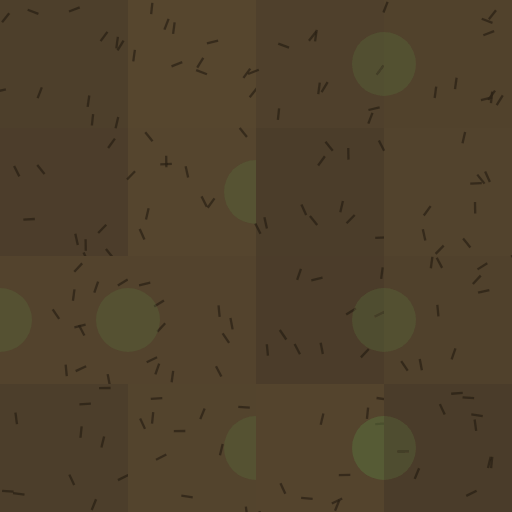

```text
FLOOR texture gulv_sti: seamless and tileable in both directions, seen straight from above (orthographic, 90 degrees). The square image covers exactly 4 x 4 metres of floor. The left edge continues into the right edge and the top edge into the bottom edge. No rugs, blood, puddles or wall shadows (the game adds them). Packed dirt #4a3c2a and #56462e with pine needles, a few roots, moss toward the edges. Square, 1024 x 1024.
The attached image shows how the game paints this surface today, over the same area. Use it only for the layout and the scale; paint it properly in the texture style.
```

## 12v. Myra (tekstur)

Filnavn: `gulv_myr.png`

Gir: `gulv_myr`

Brukes i: myra. Blir 512 x 512 punkter i spillet.

Referanse (last opp sammen med prompten): `tegnelister/referanse/ref_gulv_myr.png`

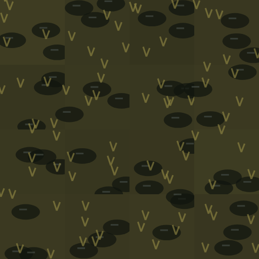

```text
FLOOR texture gulv_myr: seamless and tileable in both directions, seen straight from above (orthographic, 90 degrees). The square image covers exactly 4 x 4 metres of floor. The left edge continues into the right edge and the top edge into the bottom edge. No rugs, blood, puddles or wall shadows (the game adds them). Peat bog #34331e with black pools (#10140e) that have a faint pale glint, tufts of sedge (#968c46). Square, 1024 x 1024.
The attached image shows how the game paints this surface today, over the same area. Use it only for the layout and the scale; paint it properly in the texture style.
```

## 12w. Isen (tekstur)

Filnavn: `gulv_is.png`

Gir: `gulv_is`

Brukes i: isdammen. Blir 512 x 512 punkter i spillet.

Referanse (last opp sammen med prompten): `tegnelister/referanse/ref_gulv_is.png`

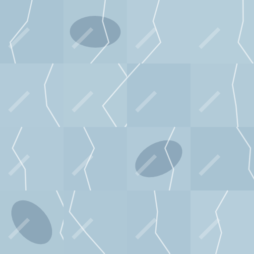

```text
FLOOR texture gulv_is: seamless and tileable in both directions, seen straight from above (orthographic, 90 degrees). The square image covers exactly 4 x 4 metres of floor. The left edge continues into the right edge and the top edge into the bottom edge. No rugs, blood, puddles or wall shadows (the game adds them). Frozen pond ice #b8d0dc and #a4c0d0, white cracks, darker depth patches (#3c5a78), a few trapped bubbles. Square, 1024 x 1024.
The attached image shows how the game paints this surface today, over the same area. Use it only for the layout and the scale; paint it properly in the texture style.
```

## 12x. Sikksakkgulvet (tekstur)

Filnavn: `gulv_sikksakk.png`

Gir: `gulv_sikksakk`

Brukes i: drømmen i kapittel 5. Blir 512 x 512 punkter i spillet.

Referanse (last opp sammen med prompten): `tegnelister/referanse/ref_gulv_sikksakk.png`

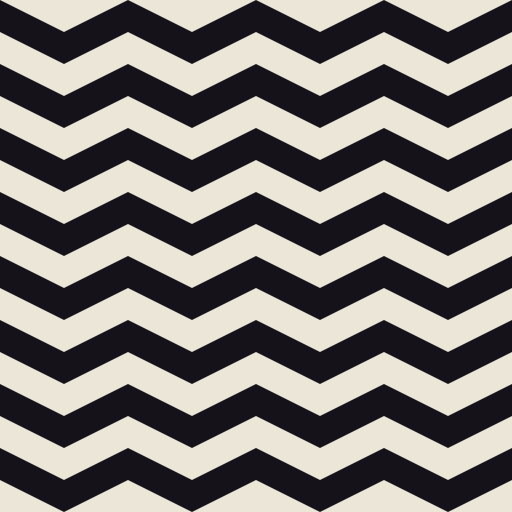

```text
FLOOR texture gulv_sikksakk: seamless and tileable in both directions, seen straight from above (orthographic, 90 degrees). The square image covers exactly 4 x 4 metres of floor. The left edge continues into the right edge and the top edge into the bottom edge. No rugs, blood, puddles or wall shadows (the game adds them). Bone-white #ece6d8 with black #16121a zigzag bands, two zigzags and two bands per metre, crisp and slightly dreamlike. Square, 1024 x 1024.
The attached image shows how the game paints this surface today, over the same area. Use it only for the layout and the scale; paint it properly in the texture style.
```
